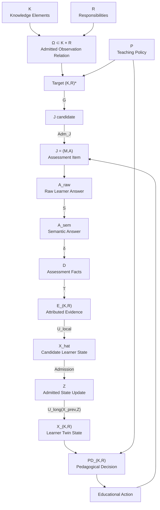
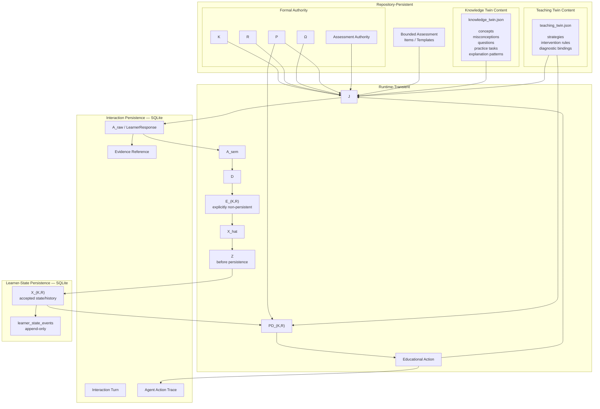
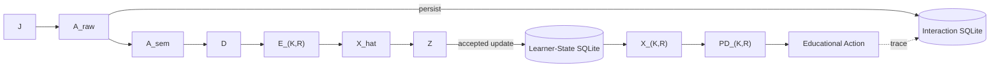
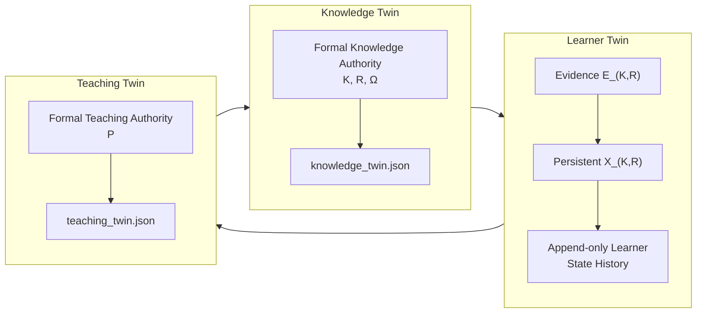
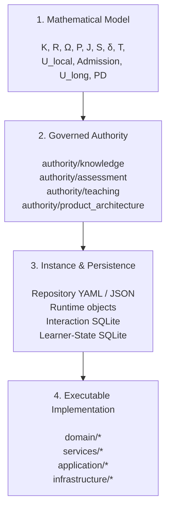

# ThreeTwinArchitectureNext — Mathematical-to-Runtime Traceability

## Purpose

This document maps the core mathematical objects and transformations in ThreeTwinArchitectureNext to four concrete architectural concerns:

1. **Authority** — where the object or transformation is governed.
2. **Instance** — what its concrete runtime or repository representation is.
3. **Persistence** — whether and where the instance is stored.
4. **Implementation** — which code realizes or consumes it.

The architecture deliberately distinguishes:

- **repository-persistent governed reference state**,
- **runtime-transient transformation state**, and
- **database-persistent learner and interaction state**.

This distinction is central to the architecture.

---

## 1. Canonical Mathematical Flow

The core execution model can be summarized as:

\[
K,R,\Omega
\rightarrow J
\rightarrow A_{raw}
\rightarrow A_{sem}
\rightarrow D
\rightarrow E_{K,R}
\rightarrow \hat X
\rightarrow Z
\rightarrow X_{K,R}
\rightarrow PD_{K,R}
\rightarrow EA
\rightarrow J'
\]

where:

- \(K\) = mathematical knowledge elements
- \(R\) = mathematical responsibilities
- \(\Omega \subseteq K \times R\) = admitted observation relation
- \(J=(M,A)\) = admitted assessment item
- \(A_{raw}\) = raw learner answer
- \(A_{sem}\) = semantically interpreted answer
- \(D\) = governed assessment facts
- \(E_{K,R}\) = evidence attributed to an exact knowledge/responsibility pair
- \(\hat X\) = locally inferred learner-state candidate
- \(Z\) = admitted learner-state update
- \(X_{K,R}\) = persistent learner state
- \(PD_{K,R}\) = pedagogical decision
- \(EA\) = educational action
- \(P\) = teaching/pedagogical policy

The principal transformations are:

\[
S:(J,A_{raw})\rightarrow A_{sem}
\]

\[
\delta:(A_{sem},J)\rightarrow D
\]

\[
T:D\rightarrow E_{K,R}
\]

\[
U_{local}:E_{K,R}\rightarrow \hat X
\]

\[
Admission:\hat X\rightarrow Z
\]

\[
U_{long}:(X_{prev},Z)\rightarrow X_{K,R}
\]

\[
PD:(X_{K,R},P,A_{eligible})\rightarrow PD_{K,R}
\]

---

## 2. Mathematical Execution Graph

This forms a closed learning loop:

**Knowledge → Observation → Assessment → Evidence → Learner State → Pedagogical Decision → Educational Action → Next Assessment**

---

## 3. Canonical Traceability Table

| Mathematical object / map | Authority / definition | Concrete instance | Lifecycle / persistence | Primary implementation |
|---|---|---|---|---|
| **\(K\)** Knowledge | `authority/knowledge/bounded_mathematical_elements_v1.yaml` | Admitted mathematical elements | **Repository-persistent — YAML** | Knowledge and evidence consumers |
| **\(R\)** Responsibility | `authority/knowledge/bounded_responsibilities_v1.yaml` | Admitted mathematical responsibilities | **Repository-persistent — YAML** | Evidence consumers |
| **\(\Omega \subseteq K\times R\)** | `authority/knowledge/bounded_responsibility_observation_v1.yaml` | Admitted observable \(K,R\) pairs | **Repository-persistent — YAML** | Knowledge/evidence projection |
| **Knowledge Twin content** | Knowledge domain model and governed boundary | Concepts, misconceptions, questions, practice tasks, explanation patterns | **Repository-persistent — `twin_substrate/knowledge/knowledge_twin.json`** | `services/knowledge_access/service.py` |
| **\(P\)** Teaching policy | `authority/teaching/bounded_pedagogical_decision_policy_v1.yaml` and related Teaching authority | Strategies, intervention rules, diagnostic bindings and policy parameters | **Repository-persistent — authority YAML + `twin_substrate/teaching/teaching_twin.json`** | `services/teaching_access/service.py` |
| **\(G\)** Assessment-item generation | `authority/product_architecture/execution_dependency_model.yaml` + Assessment authority | Candidate assessment item | **Runtime** | `domain/assessment_item/authoring.py`, `construction.py` |
| **\(Adm_J\)** Item admission | Assessment authority | Admitted assessment item | **Runtime, with repository-backed bounded instances** | `domain/assessment_item/admission.py` |
| **\(J=(M,A)\)** Assessment item | `authority/assessment/*` | Assessment items and templates | **Repository/code-backed + runtime** | `domain/assessment_item/bounded_items.py`, `bounded_templates.py`, `model.py` |
| **\(A_{raw}\)** Raw answer | Interaction/execution semantics | `LearnerResponse.learner_answer` | **Database-persistent — SQLite `interaction_evidence`, kind=`response`** | `application/interaction/*`, `infrastructure/interaction_store/sqlite.py` |
| **\(S:(J,A_{raw})\to A_{sem}\)** | Semantic-interpretation authority | Semantically interpreted answer | **Runtime-transient** | `services/semantic_interpretation/service.py` |
| **\(\delta:(A_{sem},J)\to D\)** | `authority/product_architecture/assessment_semantics.yaml` | Governed assessment facts | **Runtime-transient** | `services/assessment/answer_assessment.py`, `verification_projection.py` |
| **\(T:D\to E_{K,R}\)** | Knowledge/Responsibility/Observation authority + evidence semantics | `SessionKnowledgeElementEvidence` | **Runtime-transient; explicitly non-persistent** | `services/evidence_projection/*` |
| **\(U_{local}:E_{K,R}\to\hat X\)** | `authority/product_architecture/probabilistic_learner_state.yaml` | Locally inferred learner-state candidate | **Runtime-transient** | `services/learner_state/inference.py`, `probabilistic_update.py` |
| **\(Admission:\hat X\to Z\)** | `authority/product_architecture/learner_twin_state_admission.yaml` | Admitted state update | **Runtime until accepted** | `services/learner_state/admission.py` |
| **\(U_{long}:(X_{prev},Z)\to X_{K,R}\)** | `authority/product_architecture/probabilistic_learner_state.yaml` | Accepted Learner Twin state/history | **Database-persistent — SQLite `learner_state_events`** | `services/learner_state/probabilistic_update.py`, `infrastructure/persistence/learner_state_store.py` |
| **\(PD:(X_{K,R},P,A_{eligible})\to PD_{K,R}\)** | Teaching decision authority | Pedagogical decision | **Runtime-transient** | `services/pedagogical_decision/service.py` |
| **\(EA(PD_{K,R})\)** | `authority/teaching/bounded_educational_action_policy_v1.yaml` | Learner-facing educational action | **Runtime; action trace may persist** | `services/educational_action/service.py` |
| **Interaction provenance** | Interaction model | Turn, response, agent-action trace, evidence reference | **Database-persistent — SQLite `interaction_evidence`** | `application/interaction/evidence.py`, `infrastructure/interaction_store/sqlite.py` |

---

## 4. Authority, Instance and Persistence Architecture

The architecture uses three materially different instance lifecycles.

---

## 5. Persistence Boundary

The execution path crosses persistence boundaries at deliberately different points.

The central distinction is:

| Category | Examples | Persistence |
|---|---|---|
| **Governed reference state** | \(K,R,\Omega,P\), Knowledge/Teaching Twin content, bounded assessment items | Version-controlled repository |
| **Raw interaction evidence** | \(A_{raw}\), turns, action traces, evidence references | Interaction SQLite |
| **Transformation artifacts** | \(A_{sem},D,E_{K,R},\hat X,Z,PD_{K,R}\) | Primarily runtime-transient |
| **Accepted learner state** | \(X_{K,R}\) and accepted state events | Learner-state SQLite |

In particular, `SessionKnowledgeElementEvidence` — the implementation representation of \(E_{K,R}\) — is explicitly defined as a **non-persistent projection for one interaction/session only**.

Persistence therefore occurs on either side of the evidence-transformation pipeline rather than at every intermediate transformation.

---

## 6. Three Twin Materialization

The three Twins deliberately have different materialization models.

### Knowledge Twin

Primarily **version-controlled reference knowledge**:

- formal mathematical elements,
- mathematical responsibilities,
- admissible observation relations,
- concepts,
- misconceptions,
- questions,
- practice tasks,
- explanation patterns.

Its primary materialization is repository-backed YAML and JSON.

### Learner Twin

Primarily **learner-specific evolving state**.

Evidence is transformed transiently through:

\[
D\rightarrow E_{K,R}\rightarrow\hat X\rightarrow Z
\]

before accepted state changes are persisted as \(X_{K,R}\).

Its durable materialization is database-backed and historical.

### Teaching Twin

Primarily **version-controlled pedagogical policy and strategy**:

- decision policies,
- teaching strategies,
- intervention rules,
- diagnostic bindings,
- educational-action policy.

Its primary materialization is repository-backed YAML and JSON.

---

## 7. Four Architectural Layers

The complete architecture can therefore be viewed as four traceable layers:

The intended traceability relation is therefore:

\[
\boxed{
\text{Mathematical Model}
\longleftrightarrow
\text{Authority}
\longleftrightarrow
\text{Concrete Instance}
\longleftrightarrow
\text{Persistence}
\longleftrightarrow
\text{Implementation}
}
\]

---

## 8. Architectural Summary

ThreeTwinArchitectureNext is not simply a system containing three databases called Knowledge, Learner, and Teaching.

It is a governed closed-loop decision architecture:

\[
\boxed{
\text{Model Knowledge}
\rightarrow
\text{Design Observation}
\rightarrow
\text{Interpret Evidence}
\rightarrow
\text{Infer Learner State}
\rightarrow
\text{Choose Educational Action}
\rightarrow
\text{Observe Again}
}
\]

The three Twins play structurally different roles:

- **Knowledge Twin** provides governed reference knowledge.
- **Learner Twin** represents evolving learner-specific belief/state.
- **Teaching Twin** provides governed decision policy and pedagogical strategy.

The transformation pipeline between them is intentionally explicit.

A learner response is preserved as interaction evidence, transformed through governed but largely non-persistent intermediate representations, and only an admitted learner-state update crosses into durable Learner Twin state.

This creates a traceable separation between:

**what the system knows, what it observes, what it infers, what it persists, and what it decides.**
