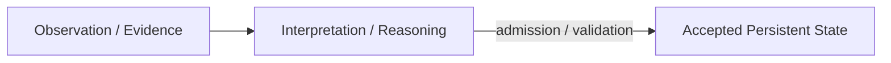
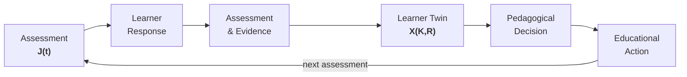
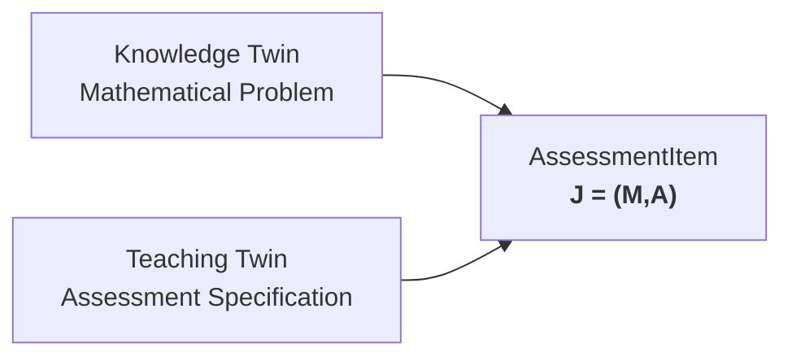
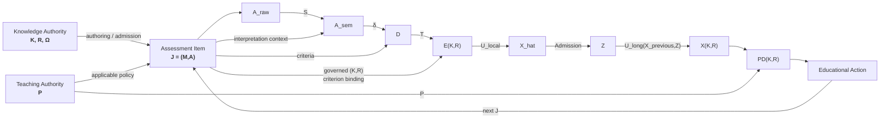
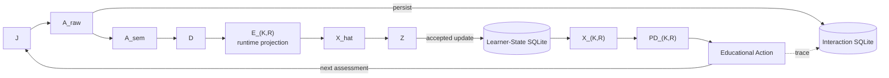
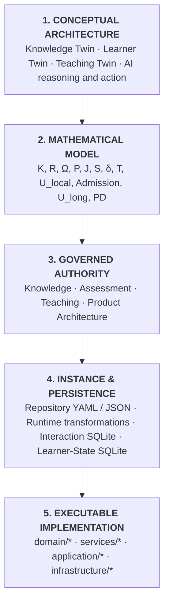

# ThreeTwinArchitectureNext — Architecture Overview

## 1. Architecture Principle

ThreeTwinArchitectureNext separates **persistent educational memory** from **active AI reasoning and action**.

The Three Twins retain structured educational state and knowledge over time. AI agents and deterministic product capabilities interpret learner input, reason over Twin context, use tools and models, and produce decisions or proposed state changes.

The architecture therefore distinguishes two enduring responsibilities:

- **Twins persist structured educational memory.**
- **AI reasoning and action operate over that memory and current interaction context.**

Persistent state changes are explicit transitions. A reasoning result, diagnosis, or recommendation does not become accepted Twin state merely because it was produced by a model or service.

The three Twins represent different kinds of persistent educational memory:

- **Knowledge Twin** — persistent memory of the educational world.
- **Learner Twin** — persistent estimated state of an individual learner.
- **Teaching Twin** — persistent pedagogical memory about how learning may be assessed and guided.

Foundation models, storage technologies, algorithms, agent frameworks, and service boundaries are implementation choices. The conceptual responsibilities of the Twins are intended to remain stable even when those implementations change.

---

## 2. The Three Twins

### Knowledge Twin

The Knowledge Twin represents the learning domain independently of any one learner.

Its content may include:

- concepts and stable concept identities,
- prerequisite and other conceptual relationships,
- mathematical problems and tasks,
- solution structures and valid transformations,
- mathematical equivalence relations and domain conditions,
- misconceptions and domain error structures,
- educational resources,
- explanation patterns, and
- evidence about the educational domain and resources.

For assessment and learner modelling, selected parts of this educational-world memory are exposed through explicit mathematical knowledge coordinates and observation semantics.

### Learner Twin

The Learner Twin represents the system's current persistent estimate of an individual learner.

Its state may include understanding, confidence, misconceptions, retention, goals, learning-relevant preferences, and accumulated learning history.

Learner state is an estimate derived from evidence, not a copy of raw interaction history. Observed behaviour is interpreted first; only accepted state transitions become persistent Learner Twin state.

In the current bounded mathematical architecture, canonical learner state is indexed by an exact `(Knowledge, Responsibility)` coordinate so that materially different observable performances over the same Knowledge can remain distinct.

### Teaching Twin

The Teaching Twin represents persistent pedagogical memory.

Its content may include:

- assessment strategies,
- intervention strategies,
- instructional alternatives,
- review policies,
- diagnostic criteria,
- evidence-granularity policy,
- follow-through and award policy,
- ambiguity and error-tolerance policy,
- probe-design policy, and
- educational research or evidence about what tends to work under different conditions.

The Teaching Twin stores pedagogical knowledge and policy. Active instructional planning, diagnosis, strategy selection, and learner-specific decision-making are performed by the reasoning and action layer.

---

## 3. Reasoning, Evidence, and Persistent State

A central state-management principle is the separation of:

1. **Observation / evidence** — what happened or was observed.
2. **Interpretation / reasoning** — what an AI agent or deterministic process infers from that evidence.
3. **Persistent Twin state** — the accepted structured memory retained for future use.

For example, a learner response is evidence. A diagnosis inferred from that response is reasoning. An accepted learner-state update is persistent Twin state.

This separation lets the system use powerful probabilistic or model-based reasoning without treating every generated interpretation as durable truth.

---

## 4. The Learning Feedback Loop

The operational system is an assessment-driven observation and action loop.

Assessment generates evidence about the learner. That evidence is interpreted and admitted into learner state. The updated learner state informs pedagogical decisions, which are realized as educational actions and lead to future observations.

The Twins provide persistent structure around this loop:

- the **Knowledge Twin** supplies educational-world semantics and observation coordinates,
- the **Learner Twin** retains accepted learner-specific state,
- the **Teaching Twin** supplies assessment and pedagogical knowledge used to interpret, decide, and act.

---

## 5. Assessment and the K × R Observation Model

For mathematical assessment, the architecture makes the observation target explicit.

Let:

\[
K = \text{mathematical knowledge elements}
\]

\[
R = \text{observable mathematical responsibilities}
\]

and let

\[
\Omega \subseteq K\times R
\]

be the admitted observation relation.

A learner-state coordinate is therefore not merely a Knowledge element. It identifies both **what mathematical content is involved** and **what observable responsibility the learner is being asked to perform**.

For example, the same mathematical concept may support different observable responsibilities such as recognizing, executing, explaining, or justifying. Keeping the exact \((K,R)\) coordinate allows the Learner Twin to represent those performances separately.

An admitted assessment item is represented as:

\[
J=(M,A)
\]

where:

- \(M\) is the mathematical problem facet,
- \(A\) is the assessment specification.

The AssessmentItem binds Knowledge-side problem semantics and Teaching-side assessment semantics into a governed observation contract.

---

## 6. Canonical Mathematical Flow

The learner-specific execution path can be summarized as:

\[
(K,R,\Omega,P)
\rightarrow J
\rightarrow A_{raw}
\rightarrow A_{sem}
\rightarrow D
\rightarrow E_{K,R}
\rightarrow \hat X
\rightarrow Z
\rightarrow X_{K,R}
\rightarrow PD_{K,R}
\rightarrow EA
\rightarrow J'
\]

where:

- \(K\) = mathematical knowledge elements
- \(R\) = mathematical responsibilities
- \(\Omega \subseteq K \times R\) = admitted observation relation
- \(P\) = teaching/pedagogical policy
- \(J=(M,A)\) = admitted assessment item
- \(A_{raw}\) = raw learner answer
- \(A_{sem}\) = semantically interpreted answer
- \(D\) = governed assessment facts
- \(E_{K,R}\) = evidence attributed to an exact knowledge/responsibility pair
- \(\hat X\) = locally inferred learner-state candidate
- \(Z\) = admitted learner-state update
- \(X_{K,R}\) = persistent learner state
- \(PD_{K,R}\) = pedagogical decision
- \(EA\) = educational action

The principal transformations are:

\[
S:(J,A_{raw})\rightarrow A_{sem}
\]

\[
\delta:(A_{sem},J)\rightarrow D
\]

\[
T:(D,\text{governed criterion }(K,R)\text{ binding},\Omega)
\rightarrow E_{K,R}
\]

\[
U_{local}:E_{K,R}\rightarrow \hat X
\]

\[
Admission:\hat X\rightarrow Z
\]

\[
U_{long}:(X_{prev},Z)\rightarrow X_{K,R}
\]

\[
PD:(X_{K,R},P,A_{eligible})\rightarrow PD_{K,R}
\]

Assessment-relevant domain and observation semantics are carried or resolvable through the admitted assessment item \(J\). The governed \((K,R)\) criterion bindings used for evidence attribution are part of that assessment contract.

---

## 7. Canonical Execution and Persistence

The mathematical flow maps to a concrete execution and persistence architecture.

The execution path preserves responsibility boundaries between observation semantics, evidence projection, learner-state inference, pedagogical decision, and educational action.

### Persistence boundaries

The principal persistence classes are:

| Category | Examples | Persistence |
|---|---|---|
| **Governed reference state** | \(K,R,\Omega,P\), Knowledge/Teaching Twin content, bounded assessment items | Version-controlled repository |
| **Raw interaction evidence** | \(A_{raw}\), turns, action traces, evidence references | Interaction SQLite |
| **Transformation artifacts** | \(A_{sem},D,E_{K,R},\hat X,Z,PD_{K,R}\) | Primarily runtime-transient |
| **Accepted learner state** | \(X_{K,R}\) and accepted state events | Learner-state SQLite |

`SessionKnowledgeElementEvidence`, the implementation representation of \(E_{K,R}\), is a session-local evidence projection. Accepted longitudinal learner state is persisted separately after admission.

---

## 8. From Architecture to Implementation

ThreeTwinArchitectureNext is designed to preserve traceability from conceptual semantics to running code.

The intended traceability relation is:

\[
\boxed{
\text{Conceptual Architecture}
\longleftrightarrow
\text{Mathematical Model}
\longleftrightarrow
\text{Authority}
\longleftrightarrow
\text{Concrete Instance}
\longleftrightarrow
\text{Persistence}
\longleftrightarrow
\text{Implementation}
}
\]

This vertical traceability complements the horizontal learner feedback loop.

---

## 9. Canonical Traceability Table

| Mathematical object / map | Authority / definition | Concrete instance | Lifecycle / persistence | Primary implementation |
|---|---|---|---|---|
| **\(K\)** Knowledge | `authority/knowledge/bounded_mathematical_elements_v1.yaml` | Admitted mathematical elements | **Repository-persistent — YAML** | Knowledge and evidence consumers |
| **\(R\)** Responsibility | `authority/knowledge/bounded_responsibilities_v1.yaml` | Admitted mathematical responsibilities | **Repository-persistent — YAML** | Evidence consumers |
| **\(\Omega \subseteq K\times R\)** | `authority/knowledge/bounded_responsibility_observation_v1.yaml` | Admitted observable \(K,R\) pairs | **Repository-persistent — YAML** | Knowledge/evidence projection |
| **Knowledge Twin content** | Knowledge domain model and governed boundary | Concepts, misconceptions, questions, practice tasks, explanation patterns | **Repository-persistent — `twin_substrate/knowledge/knowledge_twin.json`** | `services/knowledge_access/service.py` |
| **\(P\)** Teaching policy | `authority/teaching/bounded_pedagogical_decision_policy_v1.yaml` and related Teaching authority | Strategies, intervention rules, diagnostic bindings and policy parameters | **Repository-persistent — authority YAML + `twin_substrate/teaching/teaching_twin.json`** | `services/teaching_access/service.py` |
| **\(G\)** Assessment-item generation | `authority/product_architecture/execution_dependency_model.yaml` + Assessment authority | Candidate assessment item | **Runtime** | `domain/assessment_item/authoring.py`, `construction.py` |
| **\(Adm_J\)** Item admission | Assessment authority | Admitted assessment item | **Runtime, with repository-backed bounded instances** | `domain/assessment_item/admission.py` |
| **\(J=(M,A)\)** Assessment item | `authority/assessment/*` | Assessment items and templates | **Repository/code-backed + runtime** | `domain/assessment_item/bounded_items.py`, `bounded_templates.py`, `model.py` |
| **\(A_{raw}\)** Raw answer | Interaction/execution semantics | `LearnerResponse.learner_answer` | **Database-persistent — SQLite `interaction_evidence`, kind=`response`** | `application/interaction/*`, `infrastructure/interaction_store/sqlite.py` |
| **\(S:(J,A_{raw})\to A_{sem}\)** | Semantic-interpretation authority | Semantically interpreted answer | **Runtime-transient** | `services/semantic_interpretation/service.py` |
| **\(delta:(A_{sem},J)\to D\)** | `authority/product_architecture/assessment_semantics.yaml` | Governed assessment facts | **Runtime-transient** | `services/assessment/answer_assessment.py`, `verification_projection.py` |
| **\(T:D\to E_{K,R}\)** | Knowledge/Responsibility/Observation authority + evidence semantics | `SessionKnowledgeElementEvidence` | **Runtime-transient** | `services/evidence_projection/*` |
| **\(U_{local}:E_{K,R}\to\hat X\)** | `authority/product_architecture/probabilistic_learner_state.yaml` | Locally inferred learner-state candidate | **Runtime-transient** | `services/learner_state/inference.py`, `probabilistic_update.py` |
| **\(Admission:\hat X\to Z\)** | `authority/product_architecture/learner_twin_state_admission.yaml` | Admitted state update | **Runtime until accepted** | `services/learner_state/admission.py` |
| **\(U_{long}:(X_{prev},Z)\to X_{K,R}\)** | `authority/product_architecture/probabilistic_learner_state.yaml` | Accepted Learner Twin state/history | **Database-persistent — SQLite `learner_state_events`** | `services/learner_state/probabilistic_update.py`, `infrastructure/persistence/learner_state_store.py` |
| **\(PD:(X_{K,R},P,A_{eligible})\to PD_{K,R}\)** | Teaching decision authority | Pedagogical decision | **Runtime-transient** | `services/pedagogical_decision/service.py` |
| **\(EA(PD_{K,R})\)** | `authority/teaching/bounded_educational_action_policy_v1.yaml` | Learner-facing educational action | **Runtime; action trace may persist** | `services/educational_action/service.py` |
| **Interaction provenance** | Interaction model | Turn, response, agent-action trace, evidence reference | **Database-persistent — SQLite `interaction_evidence`** | `application/interaction/evidence.py`, `infrastructure/interaction_store/sqlite.py` |

---

## 10. Summary

ThreeTwinArchitectureNext combines three forms of persistent educational memory with an active reasoning and action layer.

- **Knowledge Twin** preserves the educational world.
- **Learner Twin** preserves the evolving estimate of the learner.
- **Teaching Twin** preserves pedagogical knowledge and policy.
- **AI reasoning and action** interpret evidence, form learner-specific inferences, make pedagogical decisions, and propose state changes.

For mathematical assessment, the architecture makes learner observation explicit through governed \((K,R)\) coordinates and an admitted AssessmentItem contract. Evidence flows through semantic interpretation, assessment, evidence projection, learner-state inference, state admission, pedagogical decision, and educational action.

The result is a system in which educational meaning, learner state, pedagogical policy, runtime reasoning, persistence, and implementation remain traceable without being collapsed into one layer.