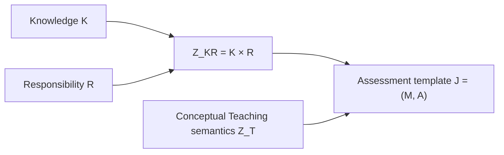
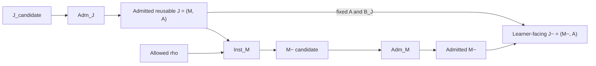
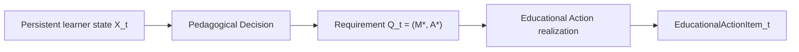
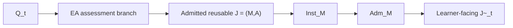
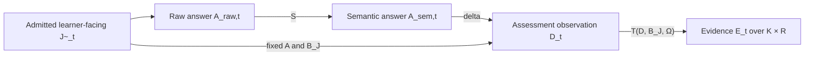
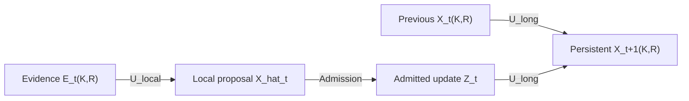

# ThreeTwinArchitectureNext — Architecture Overview

## 1. Architecture Principle

ThreeTwinArchitectureNext separates **persistent educational memory** from **active reasoning and action**.

The Three Twins retain structured educational knowledge and state over time. AI agents and deterministic Product Capabilities interpret learner input, reason over Twin context, use models and tools, make pedagogical decisions, realize educational actions, and propose state changes.

The enduring rule is simple:

- **Twins persist structured educational memory.**
- **The reasoning and action layer operates over that memory and the current interaction.**
- **Persistent changes occur only through explicit governed transitions.**

A model output, diagnosis, assessment result, recommendation, or generated item does not become persistent truth merely because it was produced. Semantic authority, validation, admission, and persistence remain explicit boundaries.

The three Twins are:

- **Knowledge Twin** — persistent memory of the educational world.
- **Learner Twin** — persistent estimated state of an individual learner.
- **Teaching Twin** — persistent pedagogical memory about how learning is assessed and guided.

Foundation models, algorithms, storage technologies, agent frameworks, and service boundaries are replaceable implementation choices. The architecture is defined primarily by semantic responsibility and information flow.

---

## 2. The Three Twins

### Knowledge Twin

The Knowledge Twin represents the learning domain independently of any learner.

It may contain:

- mathematical concepts and stable Knowledge identities,
- prerequisite and other conceptual relationships,
- mathematical problems and task families,
- solution structures and valid transformations,
- equivalence relations and domain conditions,
- misconception and error structures,
- educational resources and explanation patterns, and
- accumulated evidence about the domain and resources.

For the mathematical model below, let \(K\) denote the learner-independent Knowledge space. The Knowledge Twin owns \(K\) and mathematical truth.

A Knowledge element may be primitive or explicitly composed. Composition is itself governed: the existence of relations between Knowledge elements does not automatically create every possible composed coordinate, nor does a graph relation imply learner-state propagation.

### Learner Twin

The Learner Twin stores the system's accepted estimate of an individual learner.

Learner state is not raw interaction history and is not objective truth. It is a governed estimate derived from evidence over time.

The canonical learner-state address is an exact pair

\[
(K,R),
\]

where \(R\) describes the observable performance being demonstrated over Knowledge \(K\). Keeping the pair intact allows different kinds of performance over the same mathematical Knowledge to remain distinguishable.

A Knowledge-only mastery summary may be derived for presentation under an explicit aggregation policy, but it is not the canonical state and is not a substitute for pair-indexed state.

### Teaching Twin

The Teaching Twin stores reusable pedagogical memory.

It may contain:

- assessment and intervention strategies,
- instructional alternatives,
- diagnostic and evidence policies,
- review policies,
- follow-through and award rules,
- ambiguity and error-tolerance rules,
- probe-design policy, and
- educational research or accumulated evidence about what tends to work.

Let \(P\) denote governed reusable Teaching policy.

The Teaching Twin stores policy and pedagogical knowledge. Learner-specific diagnosis, planning, selection, and action realization occur in the active reasoning and action layer.

---

## 3. Two Semantic Structures

The architecture separates **what performance is about** from **how an educational interaction observes and interprets it**.

### Knowledge–Responsibility space

Let

\[
Z_{KR}=K\times R,
\]

where:

- \(K\) is the Knowledge space,
- \(R\) is the space of stable, learner-independent, problem-independent observable Responsibilities.

Not every formal pair must be meaningful. The governed observation relation is

\[
\Omega\subseteq K\times R.
\]

\(\Omega\) identifies the admitted Knowledge–Responsibility pairs that the system is prepared to treat as observable semantic coordinates.

This space is used for exact learner evidence and persistent learner state.

\[
E_t\in Z_{KR}, \qquad X_t: Z_{KR}\rightarrow \text{learner-state estimates}.
\]

Knowledge owns \(K\) and mathematical truth. Responsibility semantics are governed observable-performance semantics. Their product \(Z_{KR}\) is therefore a neutral cross-Twin semantic address space rather than an object owned wholly by one Twin.

### Teaching-side measurement semantics

The Teaching side conceptually contains reusable observation/evidence semantics and pedagogical policy semantics. We denote this conceptual structure by

\[
Z_T.
\]

\(Z_T\) is deliberately conceptual: the architecture does not require one complete global Observation × Policy ontology.

Concrete assessments materialize the Teaching semantics they need inside their assessment facet. Criterion structures are therefore local materializations within an assessment, not a second canonical global coordinate system.

The two structures meet through governed assessment bindings rather than by collapsing into one ontology.

---

## 4. The Assessment Model

Assessment is one Educational Action modality with a formal measurement path.

### Reusable assessment template

A reusable admitted assessment resource is

\[
J=(M,A),
\]

where:

- \(M\) is the Knowledge-owned mathematical or task-family facet,
- \(A\) is the fixed assessment facet containing problem-specific Teaching/measurement semantics.

\(J\) is learner-independent and reusable. It is a template family rather than a learner-facing concrete item.

The assessment facet contains a governed template-level binding

\[
B_J,
\]

which connects the assessment's observation semantics to exact coordinates in \(Z_{KR}\). In the bounded implementation this relation is resolved through criterion-addressed diagnostic bindings. Coverage fields such as target \(K\times R\) pairs are derived views of this governed binding, not a competing source of truth.

The admitted template is created through an explicit admission boundary:

\[
Adm_J(J_{candidate})=J.
\]

Admission establishes that the reusable family is semantically coherent and versioned before it can participate in runtime realization.

### Concrete realization

The mathematical facet of an admitted template may expose governed realization parameters \(\rho\). A concrete mathematical instance is produced by

\[
\widetilde M_{candidate}=Inst_M(J,\rho).
\]

This instantiation is learner-independent and target-preserving. It may not inspect learner state, learner identity, previous answers, or Educational Action history, and it may not change \(A\), \(B_J\), or the selected semantic target.

The concrete mathematical instance then passes a separate post-instantiation admission boundary:

\[
\widetilde M=Adm_M(\widetilde M_{candidate},J).
\]

Only then does the learner-facing assessment item exist:

\[
\widetilde J=(\widetilde M,A).
\]

Thus the reusable family and concrete item have different lifecycle boundaries:

The key invariant is that \(A\) and \(B_J\) are fixed at template admission and remain unchanged across concrete realizations.

---

## 5. From Learner State to Educational Action

The generic adaptive control path is

\[
X_t\rightarrow PD\rightarrow Q_t\rightarrow EA\rightarrow EducationalActionItem_t.
\]

### Pedagogical Decision

Pedagogical Decision, \(PD\), is the sole learner-specific selector.

It reasons over persistent learner state, Teaching policy, eligible action classes, and other governed context to determine what educational need should be acted on next.

Its output is represented by the transient requirement

\[
Q_t=(M_t^*,A_t^*).
\]

Here:

- \(M_t^*\) is the Knowledge–Responsibility-side requirement, such as exact \(K\times R\) coordinates or governed coverage requirements;
- \(A_t^*\) is the Teaching-side requirement, such as pedagogical intent, modality, and realization constraints.

\(Q_t\) may also carry decision provenance and constraints that are not local to one coordinate.

Its minimum contract therefore includes:

- semantic target or governed coverage,
- pedagogical intent,
- modality constraint,
- hard realization constraints,
- decision provenance,
- optional soft realization guidance.

\(Q_t\) is transient. It is the semantic handoff between learner-specific decision-making and learner-independent resource realization.

### Educational Action realization

Educational Action, \(EA\), consumes \(Q_t\) and governed reusable resource signatures.

It does not re-read \(X_t\) to choose a different target. The learner-specific choice has already been made by \(PD\).

Its generic stages are:

1. **hard eligibility** — every mandatory requirement in \(Q_t\) must be satisfied;
2. **soft fit** — eligible resources may be compared using governed modality-specific preferences;
3. **realization** — permitted parameters are bound without changing target, intent, or modality;
4. **modality-specific admission** — additional admission is applied where that modality requires it.

If no resource satisfies all hard requirements, realization fails closed rather than silently relaxing the request.

Assessment is one branch of this generic action model. Explanation, hint, worked example, guided practice, and other modalities may use different resource and admission structures and do not inherit assessment-specific \(B_J\) semantics.

---

## 6. Assessment as an Educational Action

When \(Q_t\) calls for an assessment, EA selects from learner-independent admitted assessment resources whose signatures describe what they can realize.

A resource signature may expose properties such as:

- realizable exact \(K\times R\) coverage,
- supported pedagogical intents,
- modality and response form,
- policy compatibility,
- permitted realization parameters,
- calibrated or intrinsic challenge information,
- provenance and admission metadata.

The assessment branch is therefore:

\[
Q_t
\rightarrow EA_{assessment}
\rightarrow J
\rightarrow Inst_M
\rightarrow Adm_M
\rightarrow \widetilde J_t.
\]

The assessment family \(J\) is admitted before realization. Each mathematical realization is separately admitted by \(Adm_M\). EA may orchestrate these steps, but it does not absorb or redefine their admission authority.

---

## 7. From Learner Response to Evidence

A learner-facing assessment \(\widetilde J_t\) enters the measurement path only after realization and admission.

The learner produces a raw answer

\[
A_{raw,t}.
\]

Semantic Interpretation transforms the raw response into a governed semantic representation:

\[
S:(\widetilde J_t,A_{raw,t})\rightarrow A_{sem,t}.
\]

Assessment then evaluates that semantic answer under the fixed assessment semantics in \(A\):

\[
\delta:(A_{sem,t},\widetilde J_t)\rightarrow D_t,
\]

where \(D_t\) is the criterion-local governed assessment observation in conceptual Teaching-side measurement semantics.

The observation is then projected to exact learner evidence through the pre-governed assessment binding:

\[
T:(D_t,B_J,\Omega)\rightarrow E_t.
\]

with

\[
E_t\in Z_{KR}.
\]

This gives three distinct objects:

\[
D_t\neq E_t\neq X_t.
\]

- \(D_t\): what the assessment observed under its measurement semantics;
- \(E_t\): governed learner evidence addressed to exact \(K\times R\) coordinates;
- \(X_t\): persistent estimated learner state accumulated over time.

Raw learner work is interpreted once at the semantic boundary. Downstream assessment and evidence projection operate on governed semantic artifacts rather than repeatedly reinterpreting the raw answer.

---

## 8. Learner-State Update

Evidence does not become persistent Learner Twin state directly.

The update path is

\[
E_t
\xrightarrow{U_{local}}
\widehat X_t
\xrightarrow{Admission}
Z_t
\xrightarrow{U_{long}(X_t,\cdot)}
X_{t+1}.
\]

where:

- \(\widehat X_t\) is a session-local state proposal,
- \(Z_t\) is the admitted state update,
- \(X_{t+1}\) is persistent longitudinal learner state.

Longitudinal state remains indexed by the exact Knowledge–Responsibility pair. Evidence attached to one pair does not automatically propagate to another Responsibility or through Knowledge graph relations.

This separation keeps observations, inference, admission, and persistence independently governable.

---

## 9. The Closed Adaptive Loop

The architecture closes a learning loop by connecting two distinct paths:

1. **control and action realization** — choose and realize what the learner should encounter next;
2. **measurement and state update** — interpret what happened and update the learner model.

For the assessment modality, the combined loop is

\[
X_t
\rightarrow PD
\rightarrow Q_t
\rightarrow EA_{assessment}
\rightarrow J
\rightarrow Inst_M
\rightarrow Adm_M
\rightarrow \widetilde J_t
\rightarrow A_{raw,t}
\rightarrow S
\rightarrow A_{sem,t}
\rightarrow \delta
\rightarrow D_t
\rightarrow T
\rightarrow E_t
\rightarrow U
\rightarrow X_{t+1}.
\]

```mermaid
flowchart LR
    X["X_t"]
    PD["PD"]
    Q["Q_t"]
    EA["EA assessment"]
    J["Reusable J"]
    IM["Inst_M"]
    AM["Adm_M"]
    JT["J~_t"]
    R["Learner response"]
    S["S"]
    DELTA["delta"]
    D["D_t"]
    T["T"]
    E["E_t"]
    U["State update"]
    X2["X_t+1"]

    X --> PD --> Q --> EA --> J --> IM --> AM --> JT
    JT --> R --> S --> DELTA --> D --> T --> E --> U --> X2
```

The two paths remain conceptually separate even when one application workflow executes them together. Only an admitted realized AssessmentItem enters the assessment measurement path. Non-assessment Educational Actions can participate in the control loop without being treated as mastery evidence.

A separate Educational Action interaction history \(H_{EA,t}\) may eventually record what interventions occurred. That history is not mastery evidence and cannot update learner state except through a separately governed evidence path.

---

## 10. Static and Dynamic Objects

The mathematical model becomes compact when its objects are grouped by lifecycle.

### Learner-independent structures

\[
K,\ R,\ \Omega,\ P,\ J,\ M,\ A,\ B_J
\]

These define the semantic and reusable resource substrate.

### Learner-specific dynamic objects

\[
X_t,\ Q_t,\ D_t,\ E_t,\ H_{EA,t}.
\]

Their roles are distinct:

| Symbol | Role | Persistence |
|---|---|---|
| \(X_t\) | persistent pair-indexed Learner State | persistent |
| \(Q_t\) | selected Educational Action requirement | transient |
| \(D_t\) | assessment observation under Teaching-side semantics | transient |
| \(E_t\) | exact \(K\times R\) learner evidence event | evidence record / transition input |
| \(H_{EA,t}\) | Educational Action interaction history | reserved governed history; not mastery state |

This separation is what allows the architecture to evolve without collapsing domain knowledge, learner modeling, pedagogical control, assessment measurement, and interaction history into one state object.

---

## 11. Current Implementation Scope

The repository currently validates a bounded end-to-end adaptive assessment composition, while the conceptual architecture is broader.

The strongest validated path covers:

- governed \(K\), \(R\), and partial \(\Omega\),
- admitted reusable assessment templates \(J=(M,A)\),
- fixed template-level \(B_J\),
- bounded mathematical family instantiation \(Inst_M\),
- separate post-instantiation admission \(Adm_M\),
- raw-to-semantic answer interpretation \(S\),
- assessment \(\delta\),
- exact-pair evidence projection \(T\),
- local and longitudinal pair-indexed learner-state update,
- pair-aware Pedagogical Decision,
- explicit transient \(Q_t\), and
- the bounded fixed-template Assessment branch of Educational Action realization.

The generic Educational Action architecture is intentionally broader than this bounded implementation. Production-scale resource registries, arbitrary mathematical-family realization, generalized non-assessment realization, production ranking and calibration, and governed persistence of Educational Action history remain later concerns.

The distinction matters: implementation maturity qualifies how much of the architecture has been exercised; it does not redefine the architecture itself.

---

## 12. Architectural Invariants

Several invariants organize the whole system:

1. **Persistent memory and active reasoning are separate.** Twins store; agents and Product Capabilities reason and act.
2. **Mathematical truth remains Knowledge-owned.** Teaching policy may refer to it but does not redefine it.
3. **Learner state is pair-indexed.** Exact \((K,R)\) state is canonical; K-only summaries are derived views.
4. **Observation, evidence, and state are different.** \(D\), \(E\), and \(X\) have distinct semantics and transitions.
5. **Pedagogical selection and realization are separate.** \(PD\) chooses the learner-specific requirement; \(EA\) realizes it without target reselection.
6. **Reusable assessment templates and concrete items are different.** \(Adm_J\) admits \(J=(M,A)\); \(Inst_M\) realizes \(\widetilde M\); \(Adm_M\) admits the realization; the learner receives \(\widetilde J=(\widetilde M,A)\).
7. **Assessment bindings are fixed before the answer.** \(A\) and \(B_J\) do not change in response to learner performance.
8. **Hard requirements fail closed.** Educational Action does not silently relax target, intent, modality, policy, or mandatory constraints.
9. **Non-assessment actions are not forced through assessment semantics.** Assessment is one modality, not the universal action schema.
10. **History is not mastery.** Interaction history may inform later decisions but cannot substitute for governed learner evidence.

Together these boundaries produce a system in which AI reasoning can remain flexible while persistent educational semantics stay explicit, inspectable, and governable.