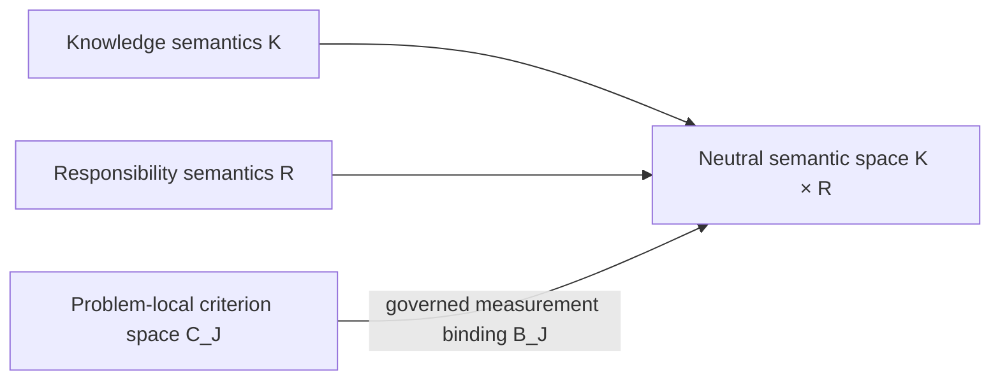
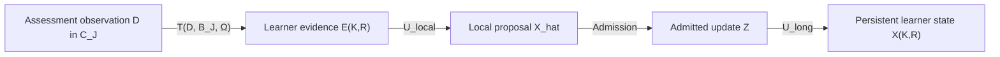
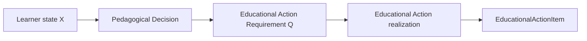
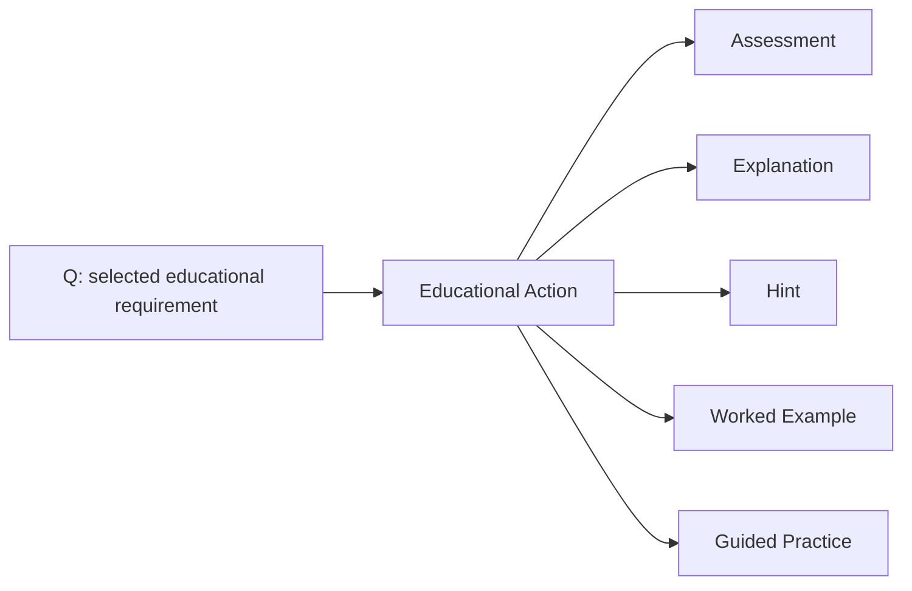
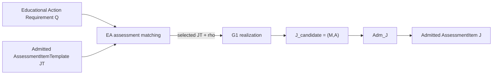
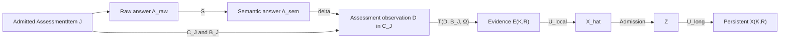

# ThreeTwinArchitectureNext — Architecture Overview

## 1. Architecture Principle

ThreeTwinArchitectureNext separates **persistent educational memory** from **active AI reasoning and action**.

The Three Twins retain structured educational state and knowledge over time. AI agents and deterministic Product Capabilities interpret learner input, reason over Twin context, use tools and models, and produce decisions or proposed state changes.

The architecture therefore distinguishes two enduring responsibilities:

- **Twins persist structured educational memory.**
- **AI reasoning and action operate over that memory and current interaction context.**

Persistent state changes are explicit transitions. A reasoning result, diagnosis, recommendation, or generated resource does not become accepted Twin state merely because it was produced by a model or service.

The three Twins represent different kinds of persistent educational memory:

- **Knowledge Twin** — persistent memory of the educational world.
- **Learner Twin** — persistent estimated state of an individual learner.
- **Teaching Twin** — persistent pedagogical memory about how learning may be assessed and guided.

Foundation models, storage technologies, algorithms, agent frameworks, and service boundaries are implementation choices. The conceptual responsibilities of the Twins are intended to remain stable even when those implementations change.

---

## 2. The Three Twins

### Knowledge Twin

The Knowledge Twin represents the learning domain independently of any one learner.

Its content may include:

- concepts and stable concept identities,
- prerequisite and other conceptual relationships,
- mathematical problems and tasks,
- solution structures and valid transformations,
- mathematical equivalence relations and domain conditions,
- misconceptions and domain error structures,
- educational resources,
- explanation patterns, and
- evidence about the educational domain and resources.

For mathematical learning, the Knowledge Twin owns mathematical knowledge coordinates \(K\) and mathematical truth. It does not own the full \(K\times R\) observation space, because observable Responsibility semantics are learner-independent product semantics rather than Knowledge itself.

### Learner Twin

The Learner Twin represents the system's current persistent estimate of an individual learner.

Its state may include understanding, confidence, misconceptions, retention, goals, learning-relevant preferences, and accumulated learning history.

Learner state is an estimate derived from evidence, not a copy of raw interaction history. Observed behaviour is interpreted first; only accepted state transitions become persistent Learner Twin state.

In the current mathematical architecture, canonical learner state is indexed by an exact `(Knowledge, Responsibility)` coordinate so that materially different observable performances over the same Knowledge can remain distinct.

### Teaching Twin

The Teaching Twin represents persistent pedagogical memory.

Its content may include:

- assessment strategies,
- intervention strategies,
- instructional alternatives,
- review policies,
- diagnostic criteria,
- evidence-granularity policy,
- follow-through and award policy,
- ambiguity and error-tolerance policy,
- probe-design policy, and
- educational research or evidence about what tends to work under different conditions.

The Teaching Twin stores pedagogical knowledge and policy. Active instructional planning, diagnosis, strategy selection, learner-specific decision-making, and action realization are performed by the reasoning and action layer.

---

## 3. Semantic Spaces

The architecture uses distinct semantic spaces for learner state and for problem-local assessment measurement.

### Knowledge–Responsibility coordinates

Let

\[
Z_{KR}=K\times R
\]

where:

- \(K\) is the set of mathematical Knowledge coordinates,
- \(R\) is the set of learner-independent observable Responsibilities.

The governed observation relation is

\[
\Omega\subseteq K\times R.
\]

An exact learner-evidence or learner-state coordinate therefore identifies both what mathematical Knowledge is involved and what observable Responsibility is being performed.

\(Z_{KR}\) is a neutral semantic address space. Knowledge owns \(K\) and mathematical truth; the product-level Responsibility semantics in \(R\) remain distinct.

### Problem-local assessment coordinates

An AssessmentItem is represented as

\[
J=(M,A),
\]

where \(M\) is the mathematical problem facet and \(A\) is the problem-specific assessment facet.

Each admitted assessment has its own criterion space

\[
C_J,
\]

and a governed sparse binding

\[
B_J:C_J\leftrightarrow K\times R.
\]

\(C_J\) represents what is observed within one specific assessment. \(B_J\) binds those problem-local observations to exact Knowledge–Responsibility coordinates.

This separation prevents assessment-specific Criterion semantics from becoming a global ontology and prevents evidence projection from guessing K×R coordinates after the learner response has already been assessed.

---

## 4. Evidence, Observation, and Learner State

A central architectural rule is that assessment observations, learner evidence, and persistent learner state are different objects.

\[
D \neq E \neq X.
\]

- \(D\) is the governed assessment observation in the problem-local space \(C_J\).
- \(E\) is learner evidence projected onto exact \(K\times R\) coordinates.
- \(X\) is the persistent Learner Twin estimate derived from admitted evidence over time.

The measurement projection is

\[
E_{K,R}=T(D,B_J,\Omega).
\]

The binding \(B_J\) is already part of the admitted assessment semantics. The projection step therefore preserves a previously governed relation; it does not reconstruct learner-state coordinates after information has been lost.

Learner-state inference then proceeds through explicit state boundaries:

\[
E_{K,R}\rightarrow \hat X\rightarrow Z\rightarrow X_{K,R},
\]

where:

- \(\hat X\) is a session-local learner-state proposal,
- \(Z\) is the admitted state update,
- \(X_{K,R}\) is persistent longitudinal learner state.

---

## 5. Pedagogical Decision and Educational Action

After learner state has been updated, the system moves from measurement to action.

The generic control path is

\[
X_t\rightarrow PD\rightarrow Q_t\rightarrow EA\rightarrow EducationalActionItem_t.
\]

### Pedagogical Decision

Pedagogical Decision \(PD\) is the learner-specific decision capability. It uses persistent learner state together with governed Knowledge structure and Teaching policy to identify what educational need should be acted on next.

Its selected result includes an exact \(K\times R\) target and a pedagogical intent.

### Educational Action Requirement

\(Q_t\) is the transient Educational Action Requirement selected by PD.

Its minimum semantic contract includes:

- the exact semantic target or governed coverage requirement,
- pedagogical intent,
- required or admissible modality,
- hard realization constraints,
- decision provenance, and
- optional realization guidance such as soft preferences or desired challenge.

Q intentionally does not carry raw learner state, posterior maps, learner identity, or unrestricted interaction history. It is the boundary between learner-specific decision-making and learner-independent resource realization.

### Educational Action

Educational Action \(EA\) consumes Q together with governed reusable resources.

EA does not re-read learner state to choose a different target or intent. Its generic stages are:

1. hard eligibility and admissibility filtering,
2. governed soft fit among eligible resources,
3. realization or materialization,
4. modality-specific admission where required.

---

## 6. Educational Action Modalities

Assessment is one Educational Action modality, not the definition of Educational Action itself.

Conceptually, Q may be realized through multiple modalities:

Different modalities may use different resource structures and different admission semantics.

Assessment has a formal measurement model because learner performance is interpreted as evidence. Explanation, hint, worked-example, and other non-assessment modalities do not inherently require \(C_J\), \(B_J\), or AssessmentItem admission semantics.

The current reusable runtime implementation is substantially more mature for the bounded Assessment branch than for the non-assessment branches.

---

## 7. Assessment Realization

For the Assessment modality, EA realizes Q through admitted reusable assessment families.

### AssessmentItemTemplate

An AssessmentItemTemplate \(JT\) is an admitted learner-independent family of valid concrete AssessmentItem realizations.

A JT defines a governed family contract including:

- stable identity and version,
- realizable exact \(K\times R\) scope,
- supported assessment intents,
- mathematical family semantics,
- assessment family semantics,
- allowed realization parameters \(\rho\),
- family invariants,
- a learner-independent resource signature \(\Phi_{JT}\), and
- provenance and admission state.

JT is admitted independently through

\[
Adm_{JT}:JT_{candidate}\rightarrow JT.
\]

### Resource matching

EA compares Q with learner-independent JT signatures \(\Phi_{JT}\).

Hard requirements are checked first. Only eligible resources proceed to governed soft fit. No global scalar score or universal vector distance is required by the architecture.

### Concrete realization

Once a JT and allowed realization parameters \(\rho\) have been selected,

\[
G1:(JT,\rho)\rightarrow J_{candidate}.
\]

G1 materializes one concrete mutually consistent

\[
J_{candidate}=(M,A)
\]

without reselecting Q's semantic target, intent, or modality.

Concrete learner-facing use still requires separate item admission:

\[
Adm_J:J_{candidate}\rightarrow J.
\]

The older bounded authoring map \(G\) remains useful as an explicit-target authoring substrate. The canonical assessment-runtime realization boundary is now expressed through JT, G1, and separate concrete item admission.

---

## 8. Assessment Measurement and Learner-State Update

Once an admitted AssessmentItem has been presented and the learner responds, the system enters the measurement and state-update path.

\[
J_t
\rightarrow A_{raw}
\rightarrow A_{sem}
\rightarrow D_t\in C_J
\rightarrow E_t\in K\times R
\rightarrow X_{t+1}.
\]

The principal transformations are:

\[
S:(J,A_{raw})\rightarrow A_{sem}
\]

\[
\delta:(A_{sem},J)\rightarrow D
\]

\[
T:(D,B_J,\Omega)\rightarrow E_{K,R}
\]

\[
U_{local}:E_{K,R}\rightarrow \hat X
\]

\[
Admission:\hat X\rightarrow Z
\]

\[
U_{long}:(X_{prev},Z)\rightarrow X_{K,R}.
\]

Assessment observation \(D\) is not itself learner evidence, and learner evidence \(E\) is not itself persistent state. Each transition has its own semantic responsibility and validation boundary.

---

## 9. Closed Adaptive Assessment Cycle

The bounded adaptive Assessment workflow closes the measurement loop and the Educational Action loop.

```mermaid
flowchart LR
    X["Learner state X_t"]
    PD["Pedagogical Decision"]
    Q["Requirement Q_t"]
    EA["EA assessment branch"]
    JT["JT matching"]
    G1["G1"]
    ADM["Adm_J"]
    J["Assessment J_t"]
    R["Learner response"]
    M["Assessment measurement"]
    E["Evidence E_t"]
    U["Learner-state update"]
    X2["Learner state X_t+1"]

    X --> PD --> Q --> EA --> JT --> G1 --> ADM --> J
    J --> R --> M --> E --> U --> X2
```

In the current bounded runtime composition, the cycle is materially executable:

\[
X_t
\rightarrow PD
\rightarrow Q_t
\rightarrow EA_{assessment}
\rightarrow JT
\rightarrow G1
\rightarrow Adm_J
\rightarrow J_t
\rightarrow learner\ interaction
\rightarrow E_t
\rightarrow X_{t+1}.
\]

The architecture nevertheless keeps the two responsibilities distinct:

- the **action-realization path** decides and realizes what the learner should encounter next;
- the **measurement/state-update path** interprets what happened and updates the learner model.

Only when the realized EducationalActionItem is an admitted AssessmentItem do the two paths connect through assessment measurement semantics.

---

## 10. Current Bounded Implementation and Traceability

The current repository implements a bounded but end-to-end adaptive assessment composition. The conceptual architecture is broader than the currently validated implementation.

### Persistence boundaries

| Category | Examples | Persistence |
|---|---|---|
| Governed reference state | \(K,R,\Omega,P,JT,J\), Knowledge/Teaching Twin content | Version-controlled repository and governed runtime resources |
| Raw interaction evidence | \(A_{raw}\), interaction and response provenance | Interaction persistence |
| Runtime transformation artifacts | \(A_{sem},D,E,\hat X,Z,PD,Q\) | Primarily transient |
| Accepted learner state | \(X_{K,R}\) and admitted state events | Learner-state persistence |
| Educational Action history | \(H_{EA}\) | Reserved for future governed persistence |

### Canonical traceability

| Object / map | Meaning | Current implementation |
|---|---|---|
| \(K\) | Mathematical Knowledge coordinates | `domain/knowledge`, Knowledge authority |
| \(R\) | Observable Responsibility semantics | `authority/knowledge/bounded_responsibilities_v1.yaml`, Teaching models |
| \(\Omega\) | Admitted observable exact \(K\times R\) relation | `authority/knowledge/bounded_responsibility_observation_v1.yaml` |
| \(C_J\) | Problem-local Criterion space | AssessmentSpecification / Criterion runtime bindings |
| \(B_J\) | Governed Criterion-to-\(K\times R\) measurement binding | Assessment and evidence-projection bindings |
| \(J=(M,A)\) | Admitted concrete AssessmentItem | `domain/assessment_item/model.py` |
| \(Adm_J\) | Concrete AssessmentItem admission | `domain/assessment_item/admission.py` |
| \(S\) | Raw-answer semantic interpretation | `services/semantic_interpretation` |
| \(\delta\) | Governed criterion-scoped assessment | `services/assessment` |
| \(T\) | Projection from \(D\) through \(B_J\) to exact \(K\times R\) evidence | `services/evidence_projection` |
| \(U_{local}\) | Session-local learner-state inference | `services/learner_state/inference.py` |
| Admission | State-proposal admission | `services/learner_state/admission.py` |
| \(U_{long}\) | Longitudinal exact-pair state update | `services/learner_state/probabilistic_update.py` |
| \(PD\) | Sole learner-specific selector | `services/pedagogical_decision/service.py` |
| \(Q\) | Transient Educational Action Requirement | `domain/educational_action/model.py` |
| \(EA\) | Requirement-to-resource realization control | `services/educational_action/service.py` |
| \(JT\) | Admitted reusable assessment-item family | `domain/assessment_item/template.py` |
| \(Adm_{JT}\) | Assessment-template-family admission | `domain/assessment_item/template.py`, `generic_template.py` |
| \(\Phi_{JT}\) | Learner-independent assessment-resource signature | JT matching contract |
| \(\rho\) | Family-local realization parameters | `domain/assessment_item/template.py` |
| \(G1\) | JT-to-concrete-J realization | `domain/assessment_item/realization.py` |
| \(G\) | Bounded explicit-target assessment authoring substrate | `domain/assessment_item/authoring.py`, `construction.py` |
| Adaptive assessment turn | End-to-end measurement, state update, PD, Q, EA, and next-J composition | `application/learning_workflow/assessment_turn.py` |

### Current maturity boundary

The repository currently validates a bounded Assessment branch with explicit Q, admitted fixed-template-compatible JT resources, G1 realization, separate concrete item admission, exact-pair learner state, and a deterministic two-turn adaptive assessment proof.

The architecture intentionally leaves several broader capabilities open, including:

- generalized non-assessment Educational Action realization,
- production JT registries and persistence,
- arbitrary-family G1 realization,
- production resource ranking and calibration,
- parameterized or live-model mathematical problem generation, and
- governed Educational Action history persistence and use.

These are implementation frontiers, not changes to the enduring Three-Twin principle.

---

## Summary

ThreeTwinArchitectureNext combines three persistent educational memories with an active reasoning and action system.

The architecture now separates two complementary loops:

\[
\boxed{J\rightarrow measurement\rightarrow E\rightarrow X}
\]

and

\[
\boxed{X\rightarrow PD\rightarrow Q\rightarrow EA\rightarrow EducationalActionItem}.
\]

For Assessment, the action path is realized through admitted reusable assessment families:

\[
Q\rightarrow JT\rightarrow G1\rightarrow Adm_J\rightarrow J,
\]

while learner performance is measured through problem-local Criterion semantics and projected back to exact Knowledge–Responsibility evidence:

\[
D\in C_J\rightarrow T(D,B_J,\Omega)\rightarrow E(K,R).
\]

This preserves a clear separation among educational-world knowledge, learner state, pedagogical policy, learner-specific decision-making, resource realization, assessment measurement, and persistent state transition while allowing them to compose into a closed adaptive learning cycle.
