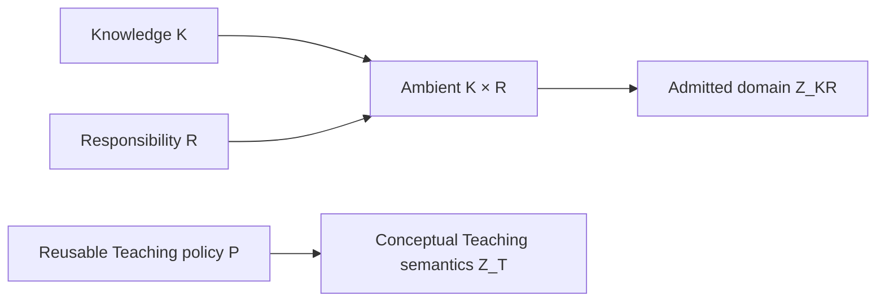
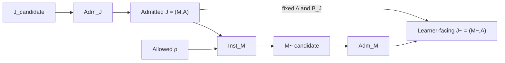
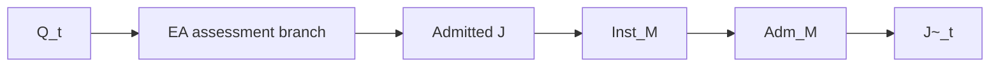
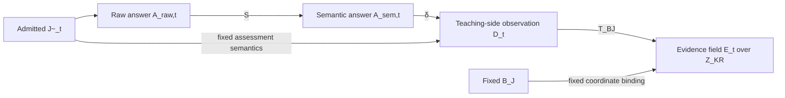

# ThreeTwinArchitectureNext — Architecture Overview

## 1. Architecture Principle

ThreeTwinArchitectureNext separates **persistent educational memory** from **active reasoning and action**.

The Three Twins retain governed educational knowledge and state over time. Active reasoning components interpret learner interaction, make pedagogical decisions, realize educational actions, assess responses, and propose state transitions. Persistence changes only through explicit governed boundaries.

The enduring division is:

- **Knowledge Twin** — learner-independent domain knowledge and mathematical truth.
- **Learner Twin** — persistent estimated state of an individual learner.
- **Teaching Twin** — reusable pedagogical, observation, evidence, and policy semantics.
- **Reasoning and action layer** — learner-specific decision-making, interpretation, assessment, realization, and state-transition logic operating over the Twins.

A generated answer, diagnosis, assessment result, recommendation, or state proposal does not become persistent truth merely because a model or algorithm produced it. Semantic authority, admission, and persistence remain explicit.

---

## 2. The Three Twins

### Knowledge Twin

The Knowledge Twin owns learner-independent domain semantics and mathematical truth.

Let \(K\) denote governed Knowledge. Knowledge may include primitive elements and explicitly admitted composed elements. Relations between Knowledge elements do not automatically create new composed coordinates, and graph structure does not imply propagation of learner state.

The Knowledge Twin also owns the semantic vocabulary of **Responsibilities** \(R\): stable, learner-independent, problem-independent observable performances over Knowledge, such as executing a procedure or applying knowledge in context. \(R\) is separately governed; it is not computed mechanically from \(K\).

### Learner Twin

The Learner Twin stores the accepted estimate of an individual learner.

The canonical learner-state address is an admitted exact Knowledge–Responsibility pair. Persistent state therefore distinguishes different observable performances over the same Knowledge.

A Knowledge-only summary may be derived for presentation under an explicit aggregation policy, but it is not the canonical learner state and is not a Pedagogical Decision input.

### Teaching Twin

The Teaching Twin stores reusable pedagogical semantics and policy.

Let \(P\) denote reusable Teaching policy. Teaching semantics include assessment policy, evidence policy, ambiguity and error-tolerance policy, intervention intent, observation semantics, and other governed instructional policy.

Learner-specific selection is not persistent Teaching memory. It occurs in the active control layer.

---

## 3. Semantic Spaces

The architecture uses two principal semantic structures.

### 3.1 Knowledge–Responsibility domain

The ambient product is

\[
K\times R.
\]

The canonical semantic domain is the **admitted subset**

\[
Z_{KR}\subseteq K\times R.
\]

Membership in \(Z_{KR}\) means that the exact \((K,R)\) pair is governed and admitted as an observable semantic coordinate. Bounded registries and exact pair records in the implementation materialize or prove membership in \(Z_{KR}\); they do not define a second canonical mathematical object.

Two important fields live over this domain:

\[
E_t: Z_{KR}\rightarrow \mathcal E,
\]

\[
X_t: Z_{KR}\rightarrow \mathcal X.
\]

Here \(E_t\) is learner evidence and \(X_t\) is persistent learner state.

### 3.2 Teaching semantic space

Let \(Z_T\) denote the conceptual Teaching-side semantic space containing reusable observation/evidence semantics and reusable Teaching policy \(P\).

\(P\) is an explicit constituent of \(Z_T\), but the architecture does not freeze one universal ontology such as Observation × Policy. Different educational modalities may materialize different governed structures within this conceptual space.

The architecture therefore keeps Knowledge–Responsibility semantics and Teaching semantics separate while allowing governed relations between them.

---

## 4. Reusable Assessment Architecture

Assessment is one Educational Action modality with a formal measurement path.

### 4.1 Reusable admitted assessment template

A reusable admitted assessment resource is

\[
J=(M,A),
\]

where:

- \(M\) is the Knowledge-side mathematical family and its governed demand over \(Z_{KR}\),
- \(A\) is the fixed assessment facet carrying Teaching-side measurement semantics, policy, provenance, and governed bindings.

\(J\) is learner-independent and reusable. It is admitted through

\[
Adm_J(J_{candidate})=J.
\]

Template admission validates authority and version integrity, realization parameter domains, family invariants, exact admitted \(Z_{KR}\) claims, assessment capability consistency, provenance, and the requirement that concrete realization still pass \(Adm_M\).

### 4.2 Fixed cross-space binding

Each admitted assessment template fixes a governed relation

\[
B_J\subseteq Z_T\times Z_{KR}.
\]

\(B_J\) links Teaching-side observation semantics to exact Knowledge–Responsibility coordinates. It is fixed before the learner response and remains invariant across realizations of the same admitted template.

In the current bounded implementation, criterion-addressed diagnostic bindings are the concrete authority that resolves \(B_J\).

### 4.3 Concrete learner-facing item

An admitted template exposes governed realization parameters \(\rho\). The mathematical family is instantiated by

\[
Inst_M(J,\rho)\rightarrow \widetilde M_{candidate}.
\]

`Inst_M` instantiates only the mathematical facet. It does not change \(A\), \(B_J\), the semantic target, or learner-specific intent.

The candidate then passes a separate admission boundary:

\[
Adm_M(\widetilde M_{candidate},J)\rightarrow \widetilde M.
\]

Only after successful \(Adm_M\) is the learner-facing item materialized:

\[
\widetilde J=(\widetilde M,A).
\]

The materialization step is representational; it introduces no second admission decision.

---

## 5. Learner-Specific Control

The generic adaptive control path is

\[
X_t\rightarrow PD\rightarrow Q_t\rightarrow EA\rightarrow EducationalActionItem_t.
\]

### 5.1 Pedagogical Decision

Pedagogical Decision \(PD\) is the sole learner-specific selector. It reads governed learner state and policy context and determines what educational need should be acted on next.

Its semantic output is the transient requirement

\[
Q_t=(M_t^*,A_t^*).
\]

- \(M_t^*\) is the Knowledge–Responsibility-side requirement over \(Z_{KR}\).
- \(A_t^*\) is the Teaching-side requirement over \(Z_T\), including pedagogical intent, modality, and realization constraints.
- cross-part constraints and decision provenance may relate the two sides.

The bounded runtime represents this structure as an explicit `EducationalActionRequirement` containing an exact target, pedagogical intent, admissible modality set, hard constraints, decision provenance, and optional realization guidance.

### 5.2 Educational Action realization

Educational Action \(EA\) consumes \(Q_t\) and learner-independent resource signatures. It does not re-read learner state to select a different target.

Its conceptual stages are:

1. hard eligibility,
2. governed soft fit among eligible resources,
3. permitted realization,
4. modality-specific admission.

If hard requirements cannot be satisfied, realization fails closed rather than silently weakening \(Q_t\).

The generic EA architecture is intentionally broader than the currently validated runtime. The fixed-template assessment branch is validated; generalized non-assessment realization remains a target architecture.

---

## 6. Assessment as an Educational Action

For the assessment modality, the bounded canonical runtime closes the realization path as

\[
Q_t
\rightarrow EA_{assessment}
\rightarrow J
\rightarrow Inst_M
\rightarrow Adm_M
\rightarrow \widetilde J_t.
\]

EA performs assessment-resource eligibility and fit over admitted learner-independent \(J\) resources, binds permitted \(\rho\), and orchestrates the canonical realization boundaries. It does not absorb the authority of \(Adm_J\), \(Inst_M\), or \(Adm_M\).

---

## 7. Response, Observation, and Evidence

A learner-facing admitted assessment item \(\widetilde J_t\) enters the measurement path.

The learner produces a raw response

\[
A_{raw,t}.
\]

Semantic Interpretation produces a governed semantic answer:

\[
S:(\widetilde J_t,A_{raw,t})\rightarrow A_{sem,t}.
\]

Assessment evaluates that semantic answer under the fixed assessment semantics:

\[
\delta:(A_{sem,t},\widetilde J_t)\rightarrow D_t.
\]

\(D_t\) is a governed Teaching-side observation object or field **over** conceptual \(Z_T\). It is not learner evidence and is not required to be a total function over \(Z_T\).

Evidence projection then uses the binding fixed in the admitted template:

\[
T_{B_J}: Obs_{governed}(Z_T)\rightarrow (Z_{KR}\rightarrow \mathcal E),
\]

so that

\[
E_t=T_{B_J}(D_t).
\]

The coordinates are already preserved by \(B_J\); projection does not reconstruct or guess them after assessment.

This keeps three different semantic layers explicit:

- \(D_t\): governed assessment observation over Teaching semantics,
- \(E_t\): learner evidence field over admitted \(Z_{KR}\),
- \(X_t\): persistent learner-state field over admitted \(Z_{KR}\).

---

## 8. Learner-State Update

Evidence does not become persistent state directly.

The state path is

\[
E_t
\xrightarrow{U_{local}}
\widehat X_t
\xrightarrow{Admission}
Z_t
\xrightarrow{U_{long}(X_t,\cdot)}
X_{t+1}.
\]

- \(\widehat X_t\) is a session-local state proposal,
- \(Z_t\) is an admitted update,
- \(X_{t+1}\) is persistent longitudinal state.

The exact \(Z_{KR}\) coordinate is preserved through this pipeline. Evidence for one Responsibility does not automatically alter another Responsibility, and Knowledge graph structure does not imply automatic state propagation.

---

## 9. Closed Adaptive Assessment Loop

The validated bounded assessment cycle connects control, realization, measurement, and persistence:

\[
X_t
\rightarrow PD
\rightarrow Q_t
\rightarrow EA_{assessment}
\rightarrow J
\rightarrow Inst_M
\rightarrow Adm_M
\rightarrow \widetilde J_t
\rightarrow A_{raw,t}
\rightarrow S
\rightarrow A_{sem,t}
\rightarrow \delta
\rightarrow D_t
\rightarrow T_{B_J}
\rightarrow E_t
\rightarrow U_{local}
\rightarrow Admission
\rightarrow U_{long}
\rightarrow X_{t+1}.
\]

```mermaid
flowchart LR
    X["X_t"] --> PD["PD"] --> Q["Q_t"] --> EA["EA assessment"]
    EA --> J["J"] --> IM["Inst_M"] --> AM["Adm_M"] --> JT["J~_t"]
    JT --> AR["A_raw,t"] --> S["S"] --> AS["A_sem,t"] --> DLT["δ"] --> D["D_t"]
    D --> T["T_BJ"] --> E["E_t"] --> UL["U_local"] --> AD["Admission"] --> LONG["U_long"] --> X2["X_t+1"]
```

The architecture closes the learner experience without collapsing semantic responsibilities: decision, realization, interpretation, assessment, evidence, and persistence remain separate governed stages.

---

## 10. Architecture → Implementation Mapping

The architecture is defined by authority, not by class names. The table below shows where the current bounded implementation materializes each principal object. A conceptual object may have multiple representations or no single runtime class.

### 10.1 Principal objects

| Object | Architectural meaning | Current implementation / representation | Current maturity |
|---|---|---|---|
| \(K\) | Learner-independent Knowledge and mathematical domain semantics | `domain/knowledge/`, `services/knowledge_access/` | `validated_reusable_bounded` |
| \(R\) | Stable learner-independent, problem-independent observable Responsibility semantics | `authority/knowledge/bounded_responsibilities_v1.yaml`, `domain/teaching/model.py` | `validated_reusable_bounded` |
| \(Z_{KR}\) | Admitted subset of ambient \(K\times R\) | `authority/knowledge/bounded_responsibility_observation_v1.yaml`; exact admitted-pair records in runtime | `validated_reusable_bounded` |
| \(P\) | Reusable Teaching policy | `authority/teaching/bounded_pedagogical_decision_policy_v1.yaml` | `implemented_bounded` |
| \(Z_T\) | Conceptual Teaching observation/evidence/policy semantic space | No single runtime class; materialized through governed Teaching and assessment semantics, notably `domain/teaching/model.py` and assessment structures | conceptual architecture |
| \(J=(M,A)\) | Admitted reusable assessment template/family | `domain/assessment_item/template.py` (`AssessmentItemTemplate`) | `validated_reusable_bounded` |
| \(M\) | Knowledge-side mathematical family of an admitted assessment template | `domain/assessment_item/template.py`, `domain/assessment_item/generic_template.py` | `validated_reusable_bounded` |
| \(A\) | Fixed assessment facet and measurement semantics | `domain/assessment_item/construction.py`, `domain/teaching/model.py`; bound into admitted template runtime | `validated_reusable_bounded` |
| \(B_J\) | Fixed admitted relation from Teaching observations to exact \(Z_{KR}\) coordinates | `domain/assessment_item/template.py` (`DiagnosticBinding`) | `validated_reusable_bounded` |
| \(\widetilde M\) | Admitted realized mathematical instance | `domain/assessment_item/realization.py` | `validated_reusable_bounded` |
| \(\widetilde J=(\widetilde M,A)\) | Learner-facing admitted assessment item | `domain/assessment_item/realization.py` materialization into `domain/assessment_item/model.py` representation | `validated_reusable_bounded` |
| \(Q_t\) | Transient Educational Action Requirement \((M_t^*,A_t^*)\) | `domain/educational_action/model.py` (`EducationalActionRequirement`) | bounded assessment branch validated; generic EA target-only |
| \(A_{raw,t}\) | Raw learner response | assessment-turn/application boundary | bounded composition |
| \(A_{sem,t}\) | Governed semantic interpretation of the response | `domain/semantic_interpretation/`, `services/semantic_interpretation/` | `validated_reusable_bounded` |
| \(D_t\) | Governed Teaching-side assessment observation object/field over \(Z_T\) | assessment verification/projection services | `validated_reusable_bounded` |
| \(E_t\) | Learner-evidence field over \(Z_{KR}\) | `services/evidence_projection/answer_assessment_adapter.py`, `services/evidence_projection/knowledge_element_mapping.py` | `validated_reusable_bounded` |
| \(X_t\) | Persistent learner-state field over \(Z_{KR}\) | `domain/learner/`, `domain/learner_state/`, `services/learner_state/` | `validated_reusable_bounded` for bounded exact-pair path |

### 10.2 Principal maps and transitions

| Map / transition | Architectural role | Current implementation | Current maturity |
|---|---|---|---|
| \(I\) | Construct and admit the problem-specific AssessmentSpecification / assessment-facet substrate | `domain/assessment_item/construction.py`, `domain/teaching/model.py` | `validated_reusable_bounded` |
| \(G\) | Author reusable \(J_{candidate}\) from explicit admitted targets and governed context | `domain/assessment_item/authoring.py`, `domain/assessment_item/construction.py`, `domain/teaching/model.py` | `validated_reusable_bounded` |
| \(Adm_J\) | Admit reusable assessment template \(J\) | `domain/assessment_item/template.py::admit_assessment_template` | `validated_reusable_bounded` |
| \(Inst_M\) | Instantiate only the mathematical family using admitted \(\rho\) | `domain/assessment_item/realization.py`, `domain/assessment_item/generic_template.py` | `validated_reusable_bounded` |
| \(Adm_M\) | Post-instantiation admission of \(\widetilde M\) under admitted-\(J\) context | `domain/assessment_item/realization.py` | `validated_reusable_bounded` |
| \(PD\) | Sole learner-specific selection of the next educational requirement | `domain/pedagogical_decision/model.py` plus bounded decision services/application flow | `validated_reusable_bounded` for bounded exact-pair selection |
| \(EA\) | Realize \(Q_t\) into a governed EducationalActionItem without target reselection | `domain/educational_action/`, `services/educational_action/` | generic: `target_only`; assessment fixed-template branch: `validated_reusable_bounded` |
| \(S\) | Interpret raw learner work into governed semantic answer | `domain/semantic_interpretation/`, `services/semantic_interpretation/` | `validated_reusable_bounded` |
| \(\delta\) | Assess semantic answer under admitted assessment semantics and produce \(D_t\) | `services/mathematical_verification/`, `services/assessment_policy/`, `services/assessment/verification_projection.py` | `validated_reusable_bounded` |
| \(T_{B_J}\) | Project governed Teaching observation to evidence field over \(Z_{KR}\) using fixed \(B_J\) | `services/evidence_projection/answer_assessment_adapter.py`, `services/evidence_projection/knowledge_element_mapping.py` | `validated_reusable_bounded` |
| \(U_{local}\) | Convert evidence into session-local state proposal | `services/learner_state/inference.py`, `domain/learner_state/proposal.py` | `validated_reusable_bounded` |
| `Admission` | Admit proposed learner-state update | `services/learner_state/admission.py`, `domain/learner/state_admission.py` | `validated_reusable_bounded` |
| \(U_{long}\) | Combine admitted update with prior persistent state | `services/learner_state/probabilistic_update.py`, `domain/learner/probabilistic_state.py` | `validated_reusable_bounded` |

### 10.3 End-to-end composition

The current bounded executable proof of the architecture is the adaptive assessment cycle implemented through `application/learning_workflow/assessment_turn.py`, with supporting domain and service modules listed above.

That bounded proof establishes the separation of responsibilities and the exact semantic flow. It does not claim production-scale registries, curriculum-wide coverage, arbitrary-family realization, calibrated production ranking, generalized non-assessment action realization, or complete Educational Action history persistence.

---

## 11. Authority and Documentation Boundary

This document is explanatory. The current architecture authority remains in `thatao72/three-twin-architecture-next`, primarily:

- `authority/architecture/three_twin.md`
- `authority/product_architecture/execution_dependency_model.yaml`
- `authority/product_architecture/assessment_semantics.yaml`
- `product/current.yaml`

This version is synchronized to architecture repository main commit `1f673497dfd93a9aa1f7519f5dd1f3055a371222`.

When implementation details and conceptual architecture differ in level of abstraction, the architectural responsibility and authority files govern the interpretation; implementation paths in the tables are traceability references, not definitions of the conceptual model.
