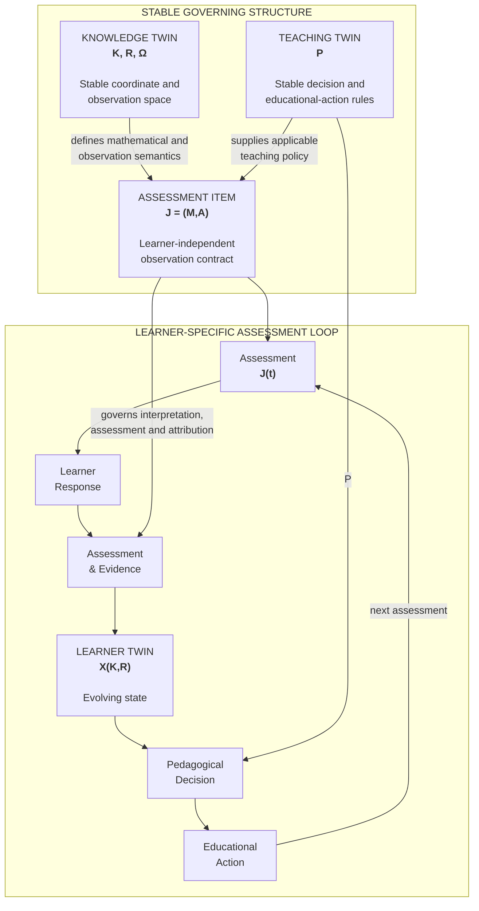
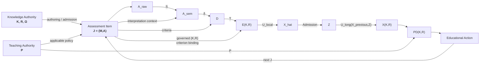
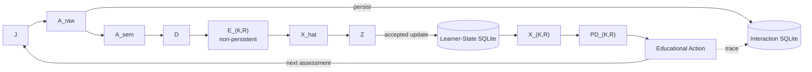
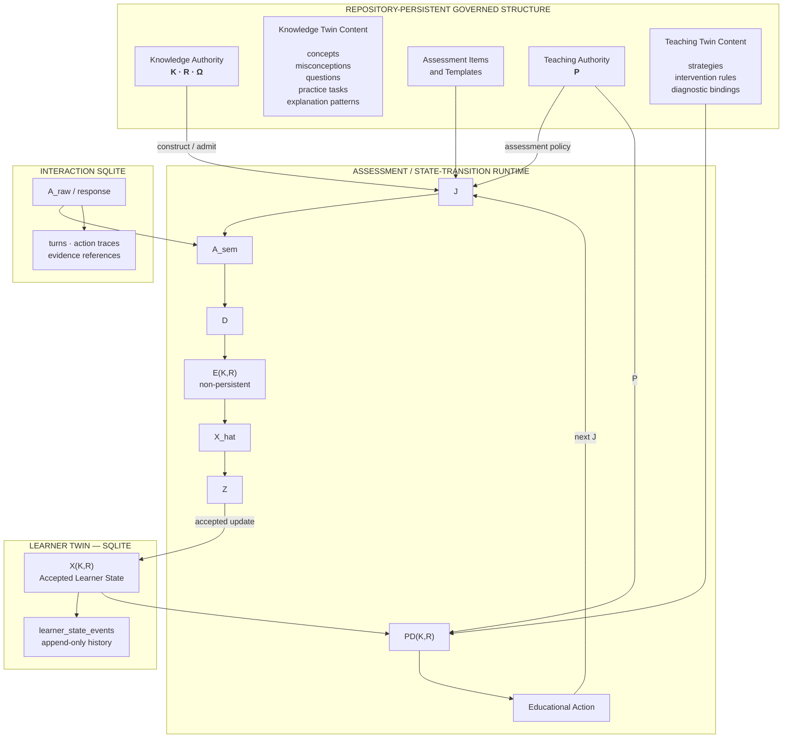
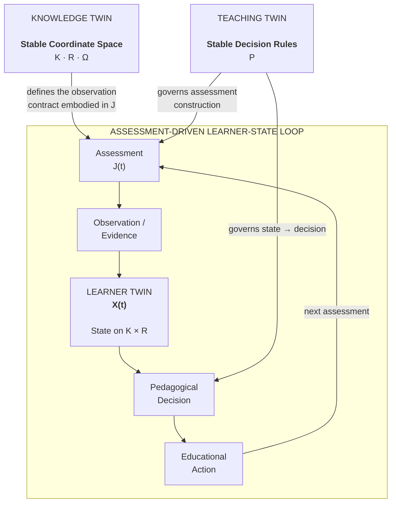
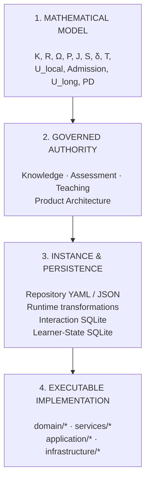

# ThreeTwinArchitectureNext — Mathematical-to-Runtime Traceability

## Purpose

This document maps the core mathematical objects and transformations in ThreeTwinArchitectureNext to four concrete architectural concerns:

1. **Authority** — where the object or transformation is governed.
2. **Instance** — what its concrete runtime or repository representation is.
3. **Persistence** — whether and where the instance is stored.
4. **Implementation** — which code realizes or consumes it.

The architecture deliberately distinguishes:

- **repository-persistent governed reference state**,
- **runtime-transient transformation state**, and
- **database-persistent learner and interaction state**.

A central architectural idea is that the three Twins play structurally different roles:

- **Knowledge Twin** defines a relatively stable coordinate and observation space.
- **Learner Twin** represents evolving learner-specific state in that space.
- **Teaching Twin** provides relatively stable decision and educational-action rules.

The operational feedback loop is closed by **Assessment**. Knowledge and Teaching govern that loop; they are not themselves stages circulating through it.

---

## 1. Canonical Mathematical Flow

The core execution model can be summarized as:

\[
(K,R,\Omega,P)
\rightarrow J
\rightarrow A_{raw}
\rightarrow A_{sem}
\rightarrow D
\rightarrow E_{K,R}
\rightarrow \hat X
\rightarrow Z
\rightarrow X_{K,R}
\rightarrow PD_{K,R}
\rightarrow EA
\rightarrow J'
\]

where:

- \(K\) = mathematical knowledge elements
- \(R\) = mathematical responsibilities
- \(\Omega \subseteq K \times R\) = admitted observation relation
- \(J=(M,A)\) = admitted assessment item
- \(A_{raw}\) = raw learner answer
- \(A_{sem}\) = semantically interpreted answer
- \(D\) = governed assessment facts
- \(E_{K,R}\) = evidence attributed to an exact knowledge/responsibility pair
- \(\hat X\) = locally inferred learner-state candidate
- \(Z\) = admitted learner-state update
- \(X_{K,R}\) = persistent learner state
- \(PD_{K,R}\) = pedagogical decision
- \(EA\) = educational action
- \(P\) = teaching/pedagogical policy

The principal transformations are:

\[
S:(J,A_{raw})\rightarrow A_{sem}
\]

\[
\delta:(A_{sem},J)\rightarrow D
\]

\[
T:(D,\text{governed criterion }(K,R)\text{ binding},\Omega)
\rightarrow E_{K,R}
\]

\[
U_{local}:E_{K,R}\rightarrow \hat X
\]

\[
Admission:\hat X\rightarrow Z
\]

\[
U_{long}:(X_{prev},Z)\rightarrow X_{K,R}
\]

\[
PD:(X_{K,R},P,A_{eligible})\rightarrow PD_{K,R}
\]

An important boundary is that downstream processing does not freely reinterpret Knowledge.

Assessment-relevant mathematical and observation semantics are carried or resolvable through the admitted assessment item \(J\). In particular, the governed criterion \((K,R)\) bindings used for evidence attribution are internal to the assessment facet of \(J\).

---

## 2. Three Twin Control Architecture

At the highest level, ThreeTwinArchitectureNext is best understood as an **assessment-driven feedback system**.

Knowledge and Teaching provide relatively stable governing structures. The Learner Twin is the evolving state.

The central relationship is therefore not:

**Knowledge → Learner → Teaching → Knowledge**

Instead:

- Knowledge defines the coordinate and observation space.
- Assessment observes learner performance in that governed space.
- Evidence updates the Learner Twin.
- Teaching policy maps learner state to pedagogical decisions and educational actions.
- The resulting action leads to the next Assessment.

The **Assessment loop**, rather than the three Twins themselves, is what closes.

---

## 3. Canonical Traceability Table

| Mathematical object / map | Authority / definition | Concrete instance | Lifecycle / persistence | Primary implementation |
|---|---|---|---|---|
| **\(K\)** Knowledge | `authority/knowledge/bounded_mathematical_elements_v1.yaml` | Admitted mathematical elements | **Repository-persistent — YAML** | Knowledge and evidence consumers |
| **\(R\)** Responsibility | `authority/knowledge/bounded_responsibilities_v1.yaml` | Admitted mathematical responsibilities | **Repository-persistent — YAML** | Evidence consumers |
| **\(\Omega \subseteq K\times R\)** | `authority/knowledge/bounded_responsibility_observation_v1.yaml` | Admitted observable \(K,R\) pairs | **Repository-persistent — YAML** | Knowledge/evidence projection |
| **Knowledge Twin content** | Knowledge domain model and governed boundary | Concepts, misconceptions, questions, practice tasks, explanation patterns | **Repository-persistent — `twin_substrate/knowledge/knowledge_twin.json`** | `services/knowledge_access/service.py` |
| **\(P\)** Teaching policy | `authority/teaching/bounded_pedagogical_decision_policy_v1.yaml` and related Teaching authority | Strategies, intervention rules, diagnostic bindings and policy parameters | **Repository-persistent — authority YAML + `twin_substrate/teaching/teaching_twin.json`** | `services/teaching_access/service.py` |
| **\(G\)** Assessment-item generation | `authority/product_architecture/execution_dependency_model.yaml` + Assessment authority | Candidate assessment item | **Runtime** | `domain/assessment_item/authoring.py`, `construction.py` |
| **\(Adm_J\)** Item admission | Assessment authority | Admitted assessment item | **Runtime, with repository-backed bounded instances** | `domain/assessment_item/admission.py` |
| **\(J=(M,A)\)** Assessment item | `authority/assessment/*` | Assessment items and templates | **Repository/code-backed + runtime** | `domain/assessment_item/bounded_items.py`, `bounded_templates.py`, `model.py` |
| **\(A_{raw}\)** Raw answer | Interaction/execution semantics | `LearnerResponse.learner_answer` | **Database-persistent — SQLite `interaction_evidence`, kind=`response`** | `application/interaction/*`, `infrastructure/interaction_store/sqlite.py` |
| **\(S:(J,A_{raw})\to A_{sem}\)** | Semantic-interpretation authority | Semantically interpreted answer | **Runtime-transient** | `services/semantic_interpretation/service.py` |
| **\(\delta:(A_{sem},J)\to D\)** | `authority/product_architecture/assessment_semantics.yaml` | Governed assessment facts | **Runtime-transient** | `services/assessment/answer_assessment.py`, `verification_projection.py` |
| **\(T:D\to E_{K,R}\)** | Knowledge/Responsibility/Observation authority + evidence semantics | `SessionKnowledgeElementEvidence` | **Runtime-transient; explicitly non-persistent** | `services/evidence_projection/*` |
| **\(U_{local}:E_{K,R}\to\hat X\)** | `authority/product_architecture/probabilistic_learner_state.yaml` | Locally inferred learner-state candidate | **Runtime-transient** | `services/learner_state/inference.py`, `probabilistic_update.py` |
| **\(Admission:\hat X\to Z\)** | `authority/product_architecture/learner_twin_state_admission.yaml` | Admitted state update | **Runtime until accepted** | `services/learner_state/admission.py` |
| **\(U_{long}:(X_{prev},Z)\to X_{K,R}\)** | `authority/product_architecture/probabilistic_learner_state.yaml` | Accepted Learner Twin state/history | **Database-persistent — SQLite `learner_state_events`** | `services/learner_state/probabilistic_update.py`, `infrastructure/persistence/learner_state_store.py` |
| **\(PD:(X_{K,R},P,A_{eligible})\to PD_{K,R}\)** | Teaching decision authority | Pedagogical decision | **Runtime-transient** | `services/pedagogical_decision/service.py` |
| **\(EA(PD_{K,R})\)** | `authority/teaching/bounded_educational_action_policy_v1.yaml` | Learner-facing educational action | **Runtime; action trace may persist** | `services/educational_action/service.py` |
| **Interaction provenance** | Interaction model | Turn, response, agent-action trace, evidence reference | **Database-persistent — SQLite `interaction_evidence`** | `application/interaction/evidence.py`, `infrastructure/interaction_store/sqlite.py` |

---

## 4. Canonical Execution and Persistence

The high-level control architecture can be expanded into the actual governed execution path.

The important dependency rule is that Knowledge is not freely re-read downstream.

\(K,R,\Omega\) participate in assessment construction and admission. Their assessment-relevant semantics are then carried by \(J\), including the governed criterion \((K,R)\) bindings used for evidence attribution.

There is intentionally:

- no direct \(K\rightarrow X\) dependency,
- no direct \(K\rightarrow PD\) dependency,
- no direct \(K\rightarrow EA\) dependency.

Likewise, Educational Action does not reselect the learner-specific target. Pedagogical Decision is the learner-specific selector; Educational Action realizes that decision.

### Persistence boundaries

The central persistence distinction is:

| Category | Examples | Persistence |
|---|---|---|
| **Governed reference state** | \(K,R,\Omega,P\), Knowledge/Teaching Twin content, bounded assessment items | Version-controlled repository |
| **Raw interaction evidence** | \(A_{raw}\), turns, action traces, evidence references | Interaction SQLite |
| **Transformation artifacts** | \(A_{sem},D,E_{K,R},\hat X,Z,PD_{K,R}\) | Primarily runtime-transient |
| **Accepted learner state** | \(X_{K,R}\) and accepted state events | Learner-state SQLite |

In particular, `SessionKnowledgeElementEvidence` — the implementation representation of \(E_{K,R}\) — is explicitly defined as a **non-persistent projection for one interaction/session only**.

Persistence therefore occurs on either side of the evidence-transformation pipeline rather than at every intermediate transformation.

---

## 5. Instance and Persistence Architecture

The same architecture can be viewed from the perspective of materialization.

This representation separates:

1. **governed reference structures**,
2. **runtime transformations**,
3. **interaction persistence**, and
4. **persistent learner state**.

---

## 6. Three Twin Roles

The three Twins are intentionally asymmetric.

### Knowledge Twin

The Knowledge Twin defines the relatively stable space in which learner state and evidence have meaning:

- mathematical elements \(K\),
- mathematical responsibilities \(R\),
- admissible observation relation \(\Omega\),
- governed knowledge content.

Its semantics enter learner-specific execution primarily through the admitted assessment item \(J\), rather than through arbitrary downstream re-reading of Knowledge.

### Learner Twin

The Learner Twin is the evolving state:

\[
X_t \in \mathcal X(K\times R)
\]

Evidence generated by Assessment updates that state:

\[
X_{t+1}=U(X_t,E_t)
\]

Intermediate evidence and inference objects remain transient until an update is admitted into persistent learner state.

### Teaching Twin

The Teaching Twin provides relatively stable decision and educational-action rules.

The pedagogical decision is governed by:

\[
PD_t = PD(X_t,P,A_{eligible})
\]

It therefore consumes the already pair-indexed learner state rather than directly re-reading Knowledge.

Educational Action realizes the selected target; it does not independently reselect it.

---

## 7. Architectural Layers

The complete system can be viewed as four traceable architectural layers.

The intended traceability relation is:

\[
\boxed{
\text{Mathematical Model}
\longleftrightarrow
\text{Authority}
\longleftrightarrow
\text{Concrete Instance}
\longleftrightarrow
\text{Persistence}
\longleftrightarrow
\text{Implementation}
}
\]

This vertical traceability is distinct from the horizontal operational feedback loop.

---

## 8. Architectural Summary

ThreeTwinArchitectureNext is not a cycle in which Knowledge, Learner, and Teaching continually transform into one another.

Its structure is more precise:

\[
\boxed{
\begin{array}{c}
\text{Knowledge Twin}\\
\text{stable coordinate / observation space}
\end{array}
}
\qquad
\boxed{
\begin{array}{c}
\text{Learner Twin}\\
\text{evolving state on that space}
\end{array}
}
\qquad
\boxed{
\begin{array}{c}
\text{Teaching Twin}\\
\text{stable decision rules}
\end{array}
}
\]

Assessment provides the feedback mechanism that connects them operationally.

The execution principle can be summarized as:

\[
\boxed{
\text{Governed Assessment}
\rightarrow
\text{Evidence}
\rightarrow
\text{Learner-State Update}
\rightarrow
\text{Pedagogical Decision}
\rightarrow
\text{Educational Action}
\rightarrow
\text{Next Assessment}
}
\]

Knowledge governs the coordinate and observation semantics embodied in the admitted assessment contract \(J\).

Teaching policy governs assessment construction and the mapping from learner state to pedagogical decision.

The Learner Twin is the principal evolving state.

This yields a deliberate separation between:

**what defines the space, what is observed, what is inferred, what is persisted, what decides, and what closes the feedback loop.**
