# ThreeTwin Architecture

## A governed measurement-and-decision architecture for personalized learning

Generative AI can solve problems, explain concepts, and generate exercises. Personalized learning requires something different: a system must decide **what a particular learner's work actually tells us**, preserve that conclusion with appropriate uncertainty, and choose what should happen next.

ThreeTwin treats that as a governed loop over a common learner-semantic base. The central discipline is simple: **generated reasoning is not automatically persistent educational truth**.

---

## 1. A learner response is not a learner model

Suppose a learner gives an incorrect answer to a differentiation problem. The error may reflect a missing concept, failure to execute a known procedure, a local algebraic error, a misunderstood condition, or an earlier error carried forward.

The response is therefore something to **measure**, not a diagnosis by itself.

ThreeTwin keeps separate:

1. what happened in the learner interaction;
2. what the assessment legitimately measured;
3. what learner-model observation follows from that measurement; and
4. what persistent learner state is justified after combining it with prior state.

This separation prevents a plausible AI explanation from silently becoming a durable claim about the learner.

---

## 2. A common semantic base: exact learning coordinates

Knowledge alone is too coarse for learner state. A learner may be able to execute a procedure without being able to justify it, or apply a concept in one context without explaining its meaning.

ThreeTwin therefore uses two learner-independent semantic ingredients:

- **Knowledge \(K\)** — the mathematical or educational object;
- **Responsibility \(R\)** — an observable performance over that Knowledge.

Not every formal combination is educationally meaningful. The canonical learner-semantic domain is the governed subset

\[
Z_{KR}\subseteq K\times R.
\]

An exact coordinate \(z\in Z_{KR}\) might mean *execute the chain rule* or *interpret a derivative in context*. The same Knowledge can therefore support distinct observable responsibilities without collapsing them into one mastery score.

The important architectural idea is that the major learner-facing structures are all addressed over this same semantic base. For a coordinate \(z\), the architecture may have:

\[
X_t(z),\qquad D_t(z),\qquad Y_t(z),\qquad Q_t(z).
\]

These are different kinds of objects: persistent learner state, response-conditioned measurement, non-persistent learner observation, and an educational-action requirement. They share an address; they do not share a meaning.

Assessment is also defined over this base, but not necessarily over only one coordinate. A reusable assessment family \(J\) has governed support

\[
\operatorname{supp}(J)\subseteq Z_{KR},
\]

so one assessment family may measure several exact learning coordinates while preserving their identities.

This common addressing is what lets ThreeTwin connect assessment, measurement, learner inference, and educational action without turning them into one undifferentiated score or model output.

---

## 3. Assessment is a measurement instrument over the semantic base

A question is not enough to define what it measures.

ThreeTwin represents a reusable assessment family as

\[
J=(M,A),
\]

where:

- \(M\) is the governed mathematical family;
- \(A\) supplies reusable Teaching-owned measurement semantics over the supported learning coordinates.

For each supported \(z\),

\[
A_J(z)\subseteq Z_T,
\]

where \(Z_T\) is the Teaching-owned vocabulary of reusable measurement dimensions. The subscript emphasizes that the relevant measurement configuration is the one carried by this assessment family; it does not create a second learner coordinate.

The key design choice is that these measurement semantics are established **before the learner answers**. A concrete realization may expose only some dimensions:

\[
O_{J,\rho}(z)\subseteq A_J(z).
\]

If a dimension is not observable from that response surface, the system emits no observation for it rather than treating absence as failure.

Thus \(J\) is not one question attached to one skill. It is a governed reusable measurement family whose support may span a set of exact \(Z_{KR}\) coordinates.

---

## 4. Measurement stays richer than learner inference

A learner-facing item and response are interpreted and assessed into a governed measurement record \(D_t(z)\) at each exact coordinate actually measured.

\(D_t(z)\) can retain verification results, criterion conditions, dependencies, provenance, and unresolved or blocking facts. It does not immediately collapse those facts into a coarse positive or negative learner signal.

The canonical local path is conceptually

\[
D_t(z)
\xrightarrow{H_z}
Y_t(z)
\xrightarrow{U_{\mathrm{local}}}
\widehat X_t(z).
\]

Here \(H_z\) and \(U_{\mathrm{local}}\) are **maps**, not stored objects:

- \(H_z\) translates governed Teaching-side measurement meaning into the observation representation required by the learner model;
- \(Y_t(z)\) is a non-persistent learner-model observation;
- \(U_{\mathrm{local}}\) performs local learner-state inference;
- \(\widehat X_t(z)\) is a session-local state proposal.

The formal learner-observation representation may contain multiple model-specific components \(Y_t(z,\lambda)\). That additional index belongs to the learner model; it does not introduce another persistent learner-state coordinate.

Measurement therefore remains richer than learner inference. The learner model decides how much an observation should change belief; it does not redefine what the assessment observed.

---

## 5. Learner State is a field over the same coordinates

Persistent Learner State is the system's accepted estimate of the learner over the admitted semantic base:

\[
X_t:Z_{KR}\rightarrow\mathcal X.
\]

The current bounded implementation uses a probabilistic supported/not-supported latent state with sequential Bayesian updating. That realization is intentionally inspectable and bounded; it is not claimed as the globally final learner model.

What is architectural is the lifecycle:

\[
D_t(z)
\rightarrow
Y_t(z)
\rightarrow
\widehat X_t(z)
\rightarrow
X_{t+1}(z),
\]

where the arrows stand for separately governed measurement-to-observation, inference, admission, and persistence operations.

A session-local inference is not persistent state merely because an algorithm or model produced it. Evidence for one \(z\) does not automatically update another, and missing evidence is not negative evidence.

---

## 6. Decide what should happen before generating it

Knowing the learner is useful only if it changes the next educational action.

Pedagogical Decision reads governed learner state and selects an exact-target Educational Action requirement \(Q_t\). Conceptually, the requirement is addressed to an exact coordinate in the same semantic base:

\[
X_t
\xrightarrow{PD}
Q_t(z).
\]

Educational Action then realizes that requirement:

\[
Q_t(z)
\xrightarrow{EA}
\text{EducationalActionItem}_t.
\]

\(PD\) and \(EA\) are maps or Product Capability operations, not additional persistent semantic objects. The realization must not silently choose a different learner target.

For assessment, generated content remains subject to reusable-family admission and post-instantiation mathematical admission. A generated problem does not become valid simply because a model produced it.

---

## 7. Where the objects live

The common \(Z_{KR}\) addressing does not mean all objects belong to one store or one authority. ThreeTwin separates persistent semantic memory from active reasoning.

### Knowledge Twin

Persistent **educational-world memory**. It owns \(K\), \(R\), admitted \(Z_{KR}\), mathematical truth, and the mathematical family \(M\).

### Teaching Twin

Persistent **pedagogical memory**. It owns reusable measurement semantics such as \(Z_T\) and the Teaching-side semantics \(A_J(z)\), together with evidence, ambiguity, assessment, and intervention policy.

### Learner Twin

Persistent **estimated learner-state memory**. It stores accepted \(X_t(z)\) over exact admitted coordinates.

Some important objects deliberately cross or sit outside these persistent authorities:

- \(J=(M,A)\) is an admitted reusable assessment resource spanning Knowledge-side mathematical semantics and Teaching-side measurement semantics;
- \(D_t(z)\) is a governed response-conditioned measurement object;
- \(H_z\) is a Teaching–Learner cross-authority map;
- \(Y_t(z)\) and \(\widehat X_t(z)\) are non-persistent learner-model objects;
- AI Product Capabilities perform interpretation, inference, pedagogical decision, generation, and other active reasoning.

The Twins store governed memory. They do not reason autonomously or mutate themselves.

---

## 8. The closed learning loop

The architecture can now be read as a loop of **objects over a common semantic base**, connected by explicitly named operations:

```mermaid
flowchart LR
    X["Persistent state X_t(z)"] -->|"PD"| Q["Requirement Q_t(z)"]
    Q -->|"EA"| J["Admitted learner-facing assessment item J~"]
    J --> R["Learner response"]
    R -->|"interpret + assess"| D["Measurement D_t(z)"]
    D -->|"H_z"| Y["Learner observation Y_t(z)"]
    Y -->|"U_local"| XH["State proposal X_hat_t(z)"]
    XH -->|"governed admission + persistence"| X2["Persistent state X_t+1(z)"]
```

The boxes are semantic or lifecycle objects; the edge labels are maps, Product Capability operations, or governed transitions.

The important property is not the number of boxes. It is that the same exact learner-semantic coordinates remain identifiable across assessment support, measurement, learner observation, state, and educational requirements while each layer retains its own authority and meaning.

That is the distinctive ThreeTwin architecture: **a shared semantic base without semantic collapse, and active AI reasoning without allowing model output to become persistent educational truth by default.**

---

For the formal model, bounded realization, quality and coverage governance, and validation status, see the **Architecture Technical White Paper**.
