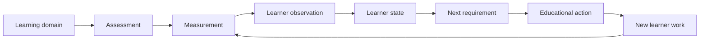
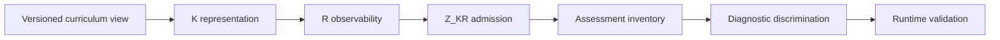

# ThreeTwin Architecture

## A governed measurement-and-decision architecture for personalized learning

Generative AI can solve problems, explain concepts, and generate exercises. Personalized learning requires something different: a system must decide **what a particular learner's work actually tells us**, preserve that conclusion with appropriate uncertainty, and choose what should happen next.

ThreeTwin treats that as a closed measurement-and-decision loop:

The architecture is built around a simple discipline: **generated reasoning is not automatically persistent educational truth**.

---

## 1. A learner response is not a learner model

Suppose a learner gives an incorrect answer to a differentiation problem. The error may reflect a missing concept, failure to execute a known procedure, a local algebraic error, a misunderstood condition, or an earlier error carried forward.

The response is therefore something to **measure**, not a diagnosis by itself.

ThreeTwin keeps separate:

1. what happened in the learner interaction;
2. what the assessment legitimately measured;
3. what learner-model observation follows from that measurement; and
4. what persistent learner state is justified after combining it with prior state.

This separation prevents a plausible AI explanation from silently becoming a durable claim about the learner.

---

## 2. Define the learning coordinate before estimating the learner

Knowledge alone is too coarse for learner state. A learner may be able to execute a procedure without being able to justify it, or apply a concept in one context without explaining its meaning.

ThreeTwin therefore uses two learner-independent semantic ingredients:

- **Knowledge \(K\)** — the mathematical or educational object;
- **Responsibility \(R\)** — an observable performance over that Knowledge.

Not every formal combination is educationally meaningful. The canonical learner-semantic domain is the governed subset

\[
Z_{KR}\subseteq K\times R.
\]

A coordinate \(z\in Z_{KR}\) might mean, for example, *execute the chain rule* or *interpret a derivative in context*. The same Knowledge can therefore support distinct observable responsibilities without collapsing them into one mastery score.

Persistent Learner State is addressed on these exact coordinates. Missing evidence for one responsibility is not negative evidence, and evidence for one responsibility does not automatically update another.

---

## 3. Assessment is a measurement instrument

A question is not enough to define what it measures.

ThreeTwin represents a reusable assessment family as

\[
J=(M,A),
\]

where:

- \(M\) is the governed mathematical family;
- \(A\) supplies reusable Teaching-owned measurement semantics for the relevant learning coordinates.

The key design choice is that the measurement semantics are established **before the learner answers**. A concrete realization may expose only the dimensions that can actually be observed. If a dimension is not observable from that response surface, the system emits no observation for it rather than treating absence as failure.

This makes assessment a governed measurement process rather than post-hoc interpretation of an answer.

---

## 4. Measurement stays richer than learner state

The learner-facing item and response are interpreted and assessed into a governed measurement record \(D_t\).

\(D_t\) is directly addressed to the exact learning coordinate \(z\) and can retain details such as verification results, criterion conditions, dependencies, provenance, and unresolved or blocking facts. It does not immediately collapse those facts into a coarse positive or negative learner signal.

The current canonical bridge to learner inference is:

\[
D_t \xrightarrow{H_z} Y_t(z,\lambda)
\xrightarrow{U_{local}} \widehat X_t.
\]

Here:

- **\(D_t\)** is the Teaching-side measurement record;
- **\(H_z\)** is a governed bridge between Teaching measurement meaning and Learner inference requirements;
- **\(Y_t\)** is a non-persistent learner-model observation;
- **\(\widehat X_t\)** is a session-local state proposal.

This is a deliberate separation of measurement from inference. The measurement layer preserves what was actually observed; the learner model decides how much that observation should change belief.

---

## 5. Learner State is an estimate, not a score

Persistent Learner State \(X_t\) is the system's accepted estimate of the learner over exact admitted \(Z_{KR}\) coordinates.

The current bounded implementation uses a probabilistic supported/not-supported latent state with sequential Bayesian updating. That implementation is intentionally inspectable and bounded; it is not claimed as the globally final learner model.

What is architectural is the contract:

\[
\mathrm{measurement}
\rightarrow
\mathrm{learner\ observation}
\rightarrow
\mathrm{state\ proposal}
\rightarrow
\mathrm{governed\ persistence}.
\]

A session-local inference is not persistent state merely because an algorithm or model produced it.

---

## 6. Why Three Twins?

Once the measurement loop is made explicit, three different kinds of persistent educational memory are required.

### Knowledge Twin

Persistent **educational-world memory**: concepts, mathematical truth, problem structures, valid transformations, relations, domain error structures, resources, and other learner-independent domain knowledge.

### Learner Twin

Persistent **estimated learner-state memory**: accepted estimates about an individual learner, addressed at the semantic granularity needed to preserve materially different observable performances.

### Teaching Twin

Persistent **pedagogical memory**: reusable assessment semantics, evidence and ambiguity policy, instructional strategies, intervention patterns, review policy, and other knowledge about how learning may be measured and guided.

The Twins store memory. They do not reason autonomously. AI Product Capabilities interpret, diagnose, decide, generate, and propose changes over that memory.

---

## 7. Decide what should happen before generating it

Knowing the learner is useful only if it changes the next educational action.

Pedagogical Decision reads governed learner state and produces an exact-target Educational Action requirement \(Q_t\). That requirement specifies what should be addressed and the constraints that the next action must satisfy.

Educational Action realization then finds or constructs a learner-facing item that satisfies the requirement. It must not silently choose a different learner target.

For assessment, the same principle applies to generated content: reusable assessment-family admission and post-instantiation mathematical admission are explicit boundaries. A generated problem does not become valid simply because a model produced it.

---

## 8. The closed learning loop

The resulting conceptual loop is:

```mermaid
flowchart LR
    X["Persistent learner state X_t"] -->|"Pedagogical Decision"| Q["Requirement Q_t"]
    Q -->|"Educational Action"| J["Learner-facing item"]
    J --> R["Learner response"]
    R --> D["Governed measurement D_t"]
    D --> H["H: measurement → learner observation"]
    H --> Y["Y_t"]
    Y --> U["Local inference"]
    U --> A["Governed state transition"]
    A --> X2["Persistent state X_t+1"]
```

The important property is not the number of boxes. It is that each transition has a distinct semantic responsibility. AI reasoning can improve without allowing model output to redefine mathematical truth, measurement meaning, or persistent learner state.

---

## 9. Scaling across a curriculum

Curriculum scale is treated as a coverage problem, not as automatic ontology generation.

The current expansion discipline proceeds through:

A syllabus heading does not automatically become Knowledge. Responsibility is not derived from topic names. Coverage is multidimensional and is not reduced to one canonical percentage.

Explicit gaps are preferable to invented semantics.

---

## 10. Measurement quality is a separate question

Semantic admission answers **whether an object is well-defined and governed**. It does not prove that an assessment measures well.

ThreeTwin therefore treats measurement quality as an orthogonal projection:

- **Q0 — admitted only**
- **Q1 — contrastively validated**
- **Q2 — adversarially validated**
- **Q3 — cross-context validated**
- **Q4 — empirically validated with real learner answers and expert reference annotations**

Maturity is **dimension-specific**. The current governance framework exercises bounded dimensions through Q2, but this does not imply that the architecture as a whole has reached Q2: unqualified aggregate maturity cannot exceed the least-supported declared dimension. Q3 requires explicit bounded cross-context evidence, and Q4 remains empirical and out of scope.

A quality failure produces a quality gap; it does not silently rewrite Knowledge, Responsibility, learner coordinates, or assessment semantics.

---

## 11. Concept, mathematics, implementation

ThreeTwin documentation deliberately separates three layers.

**Conceptual architecture** explains durable responsibilities: persistent memory versus reasoning, measurement versus inference, three Twin responsibilities, and governed state change.

**Mathematical architecture** makes those responsibilities precise through objects such as \(Z_{KR}\), \(J=(M,A)\), \(D_t\), \(H\), \(Y_t\), and \(X_t\).

**Implementation** is the current bounded realization of those contracts. Files, classes, models, storage, and agent frameworks are replaceable and do not define the conceptual architecture.

The current implementation provides bounded reusable proof of important paths. It does not claim curriculum-wide, population-calibrated, production-ready personalization.

---

## 12. The architectural invariants

The architecture can be summarized by a small set of separations:

- mathematical truth is not pedagogical policy;
- learner response is not learner state;
- measurement is not learner inference;
- learner-model observation is not persistent state;
- pedagogical decision is not content realization;
- generated output is not admitted authority;
- semantic admission is not measurement quality;
- curriculum coverage is not measurement quality;
- implementation topology is not conceptual architecture.

These boundaries allow ThreeTwin to use increasingly capable AI models while keeping educational meaning, measurement, and persistent learner state governed and inspectable.

---

For the formal model, current bounded realization, compatibility boundaries, and validation status, see the **Architecture Technical White Paper**.
