# ThreeTwin Architecture — Technical White Paper

## Governed measurement, learner-state inference, and educational action

**Audience:** technical due diligence, architecture review, and advanced product/ML readers  
**Publication role:** explanatory, not authoritative  
**Architecture source checkpoint:** `thatao72/three-twin-architecture-next@0ec25c3efcc321a15b6f3d5a2c9777916d679098`

---

## Abstract

ThreeTwin is an architecture for personalized learning in which AI reasoning is separated from persistent educational memory and in which learner modeling is treated as a governed measurement-and-inference problem.

The architecture distinguishes three persistent semantic memories — Knowledge, Learner, and Teaching — from active AI Product Capabilities. It defines learner semantics over admitted exact Knowledge–Responsibility coordinates, treats assessment as a reusable measurement family, preserves rich response-conditioned measurement records before learner-model reduction, and separates measurement, learner observation, local inference, admission, and longitudinal persistence.

The current canonical measurement-to-state path is

\[
D_t \xrightarrow{H_z} Y_t(z,\lambda)
\xrightarrow{U_{local}} \widehat X_t
\rightarrow \mathrm{governed\ state\ transition}
\rightarrow X_{t+1}.
\]

This paper explains the architecture at three levels: conceptual responsibilities, mathematical model, and current bounded implementation. The implementation demonstrates reusable architecture paths but does not constitute a claim of curriculum-wide, population-calibrated, production-ready personalization.

---

# Part I — Conceptual Architecture

## 1. The problem: personalized learning requires justified inference

Generative models can produce explanations, solutions, examples, questions, and feedback. None of those capabilities by itself establishes what an individual learner knows.

A learner response is compatible with multiple causal explanations. An incorrect answer may arise from missing domain knowledge, failure to execute a known procedure, a local mathematical error, an unobserved condition, an inherited upstream error, or a mismatch between what the assessment exposes and what the learner actually knows.

ThreeTwin therefore treats personalization as a sequence of governed transformations rather than a direct model judgment:

\[
\mathrm{learner\ interaction}
\rightarrow
\mathrm{measurement}
\rightarrow
\mathrm{learner\ observation}
\rightarrow
\mathrm{state\ inference}
\rightarrow
\mathrm{educational\ decision}.
\]

The architecture is designed so that each transformation has an explicit semantic responsibility.

## 2. Persistent educational memory versus active reasoning

The enduring ThreeTwin invariant is:

> AI Product Capabilities reason and act. Twins persist structured educational memory.

The **Knowledge Twin** stores learner-independent educational-world memory: domain concepts, mathematical truth, problem structures, valid transformations, relations, domain error structures, resources, and other reusable educational knowledge.

The **Learner Twin** stores accepted estimated state about an individual learner. It does not perform learner modeling. Raw interaction and session-local inference remain outside persistent state until a governed transition accepts them.

The **Teaching Twin** stores reusable pedagogical memory: assessment and measurement semantics, ambiguity and evidence policy, intervention strategies, review policies, and other knowledge about how learning may be measured and guided.

This separation makes foundation models, algorithms, storage systems, agent frameworks, and physical service boundaries replaceable without redefining the educational ontology.

## 3. Three separations that govern the learner model

Three distinctions are fundamental.

First, **domain truth and pedagogical admissibility are different authorities**. Mathematical equivalence is Knowledge semantics; whether an assessment awards credit for a particular form is Teaching policy.

Second, **measurement and learner inference are different operations**. Assessment should preserve what was actually observed before learner-model assumptions reduce it to a signal.

Third, **inference and persistence are different lifecycle states**. A model may propose a learner-state change; persistence requires an explicit governed transition.

These separations prevent convenient implementation shortcuts from becoming hidden educational semantics.

---

# Part II — Mathematical Architecture

## 4. Learner semantic coordinates

Let \(K\) denote governed Knowledge and \(R\) denote governed Responsibility semantics. A Responsibility is a stable, learner-independent and problem-independent observable performance over Knowledge.

The ambient product is

\[
K\times R.
\]

The canonical semantic domain is the admitted subset

\[
Z_{KR}\subseteq K\times R.
\]

Only separately governed and admitted pairs belong to \(Z_{KR}\). The architecture does not assume that every Knowledge element supports every Responsibility.

Persistent Learner State is a field

\[
X_t:Z_{KR}\rightarrow\mathcal X.
\]

The current bounded model uses a binary supported/not-supported latent representation with posterior probability, but exact-pair addressing is more fundamental than that particular state representation.

This admitted domain is the common semantic base for the major learner-facing structures. They are not the same mathematical kind, but they preserve exact addressing over the same base:

\[
\begin{aligned}
X_t &: Z_{KR}\rightarrow\mathcal X,\\
D_t &: z\mapsto D_t(z),\\
Y_t &: z\mapsto Y_t(z,\lambda),\\
Q_t &: \text{exact-}z\text{-addressed requirement},\\
J &: \operatorname{supp}(J)\subseteq Z_{KR}.
\end{aligned}
\]

This should be read as a common-base discipline, not as a claim that all objects are one uniform data structure. \(X\) is persistent learner state; \(D\) is response-conditioned measurement; \(Y\) is a non-persistent learner-model observation; \(Q\) is a transient educational-action requirement; and \(J\) is a reusable assessment family whose governed support may contain multiple exact coordinates.

The following invariants apply:

- exact-pair evidence does not collapse automatically to Knowledge-only state;
- evidence for one Responsibility does not update another without governed inference;
- missing evidence is not negative evidence;
- Knowledge graph relations do not imply posterior propagation;
- a Knowledge-only summary, if needed, is a derived view under an explicit aggregation policy.

## 5. Teaching-side measurement semantics

Let \(Z_T\) denote the reusable Teaching-owned measurement-semantics vocabulary/index space.

\(Z_T\) names dimensions through which an assessment may measure performance. It does not own mathematical truth and it does not create learner coordinates.

For an exact learning coordinate \(z\in Z_{KR}\) supported by a particular assessment family \(J\), reusable assessment semantics are conceptually addressed as

\[
A_J(z)\subseteq Z_T.
\]

The subscript makes the family-relative configuration explicit. Canonical authority may write this more compactly as \(A(z)\) when \(J\) is already fixed.

Because \(z\) already supplies Knowledge and Responsibility identity, \(A_J(z)\) should not redundantly encode another K/R identity.

This separation is important: the learner coordinate states **what educational performance is being modeled**; the Teaching measurement dimensions state **what an assessment can observe about that performance**.

## 6. Assessment as a reusable measurement family

The canonical reusable AssessmentItem is

\[
J=(M,A),
\]

where \(M\) is the governed Knowledge-side mathematical family and \(A\) is the Teaching/cross-authority measurement facet.

Template admission occurs before learner-facing realization:

\[
J_{candidate}\xrightarrow{Adm_J}J.
\]

A realization parameter \(\rho\) instantiates only the mathematical family:

\[
(M,\rho)\xrightarrow{Inst_M}\widetilde M_{candidate}
\xrightarrow{Adm_M}\widetilde M.
\]

The learner-facing realized item is then

\[
\widetilde J=(\widetilde M,A).
\]

The Teaching measurement semantics remain fixed across permitted realizations. A particular realization exposes an observable subset

\[
O_{J,\rho}(z)\subseteq A_J(z).
\]

An unobservable dimension produces no observation; absence is not converted into negative learner evidence.

This is the architecture's protection against post-hoc target reconstruction: the response is interpreted under measurement semantics that existed before the response.

## 7. Response-conditioned measurement record

After semantic interpretation and assessment, the canonical measurement object is \(D_t\).

For each exact coordinate \(z\), \(D_t\) is a rich governed measurement record whose components are typed by dimensions in \(Z_T\). It may retain:

- verification facts;
- criterion conditions;
- dependencies and follow-through structure;
- provenance;
- unresolved or blocking facts;
- response-conditioned observability.

Crucially, \(D_t\) does not need to collapse immediately to positive/negative evidence polarity.

Conceptually:

\[
(\widetilde J_t,A_{raw,t})
\xrightarrow{S}
A_{sem,t}
\xrightarrow{\delta}
D_t.
\]

The semantic interpretation map \(S\) and assessment map \(\delta\) operate under the admitted learner-facing item and its fixed measurement semantics.

## 8. The cross-authority observation bridge

The current architecture no longer treats a projected evidence field as the canonical input to learner-state inference.

Instead, the bridge

\[
H_z
\]

maps the rich measurement record into the observation representation required by the Learner model:

\[
D_t
\xrightarrow{H_z}
Y_t(z,\lambda).
\]

\(H\) belongs to neither the Teaching Twin nor the Learner Twin alone. It is a cross-authority bridge:

- Teaching authority determines the measurement meaning carried by \(D_t\);
- Learner-State authority determines the observation signals needed by its inference model;
- \(H\) may translate between them but may not redo mathematical truth or reconstruct the learner coordinate.

\(Y_t\) is non-persistent and is distinct from both \(D_t\) and \(X_t\).

The interface permits multiple observation components \(\lambda\) for one \(z\) without thereby claiming a multidimensional persistent learner state.

## 9. Local and longitudinal learner-state inference

The canonical local path is

\[
D_t\rightarrow H\rightarrow Y_t\rightarrow U_{local}\rightarrow\widehat X_t.
\]

The current bounded learner model uses provisional diagnosticity classes and sequential Bayesian update. Ambiguous and valid-but-non-discriminating observations use a unit likelihood ratio, so uncertainty does not force an update.

Persistence remains separately governed. At a high level:

\[
\widehat X_t
\rightarrow
\mathrm{Admission}
\rightarrow
U_{long}(X_t,\cdot)
\rightarrow
X_{t+1}.
\]

The architectural requirement is not that every future learner model must remain binary or use the current likelihood templates. It is that measurement, learner observation, inference proposal, and persistent state remain distinct governed objects or transitions.

## 10. Educational decision and action

Pedagogical Decision is the learner-specific selector. It reads governed learner state and produces an Educational Action requirement \(Q_t\) addressed to an exact \(z\in Z_{KR}\), together with action and realization constraints.

Conceptually:

\[
X_t\xrightarrow{PD}Q_t.
\]

Educational Action realization then maps the requirement to a learner-facing item:

\[
Q_t\xrightarrow{EA}EducationalActionItem_t.
\]

The realization layer may perform hard eligibility, governed fit, permitted realization, and modality-specific admission, but it must not silently select a different learner target.

Thus personalization is separated into **deciding what is required** and **realizing content that satisfies that requirement**.

## 11. Closed adaptive loop

For the currently validated assessment-oriented path, the conceptual loop can be read as:

```mermaid
flowchart LR
    X["X_t"] -->|"PD"| Q["Q_t"]
    Q -->|"EA assessment"| J["Admitted J"]
    J -->|"Inst_M + Adm_M"| JT["Realized J~"]
    JT --> AR["A_raw,t"]
    AR -->|"S"| AS["A_sem,t"]
    AS -->|"delta"| D["D_t"]
    D -->|"H"| Y["Y_t"]
    Y -->|"U_local"| XH["X_hat_t"]
    XH --> GS["Governed persistence"]
    GS --> X2["X_t+1"]
```

The architecture closes the learner loop without collapsing reusable semantic memory, learner-specific reasoning, measurement, inference, and persistence into one model call.

---

# Part III — Quality, Scale, and Implementation

## 12. Measurement quality is orthogonal to semantic admission

A semantically admitted Knowledge element, Responsibility, exact coordinate, or AssessmentItem may still measure poorly.

Measurement quality is therefore a downstream orthogonal projection. It does not own or mutate \(K\), \(R\), \(Z_{KR}\), \(J\), admission, curriculum coverage, or learner-state semantics.

Current maturity levels are:

- **Q0 admitted only** — semantic admission exists; systematic quality validation does not;
- **Q1 contrastively validated** — governed positive, negative, incomplete, and ambiguous cases discriminate as intended;
- **Q2 adversarially validated** — paraphrase, near-miss, irrelevant-detail, and confounder cases preserve boundaries and abstention;
- **Q3 cross-context validated** — measurement semantics remain stable across separately governed contexts;
- **Q4 empirically validated** — real learner answers and expert reference annotations support empirical validity claims.

Maturity is dimension-specific. Current bounded evidence exercises some dimensions through Q2, while other declared dimensions remain at Q1 or Q0; therefore no unqualified aggregate maturity above the least-supported declared dimension is claimed. Q3 is permitted only for explicit bounded cross-context evidence. Q4 remains empirical and out of scope.

There is no canonical scalar quality score. False positive evidence for the wrong exact coordinate is treated as more severe than fail-closed abstention, without implying a numeric utility function.

## 13. Curriculum-scale coverage

Curriculum expansion is governed separately from semantic truth and measurement quality.

The canonical chain is:

\[
\mathrm{versioned\ curriculum\ view}
\rightarrow K
\rightarrow R
\rightarrow Z_{KR}
\rightarrow G
\rightarrow J_{candidate}
\rightarrow Adm_J
\rightarrow J
\rightarrow
\mathrm{response\ discrimination}
\rightarrow
\mathrm{typed\ gaps}.
\]

Important invariants include:

- syllabus headings do not automatically become Knowledge;
- Responsibility is not derived from topic names, correctness, mastery, misconception labels, or pedagogical intent;
- no automatic graph, compositional, or curriculum-wide ontology closure occurs;
- coverage is multidimensional, not a canonical percentage;
- bounded work may terminate with explicit deferred gaps.

Coverage asks whether the required semantic and measurement inventory exists. Measurement-quality governance separately asks whether that inventory measures well.

## 14. Current bounded implementation

The current repository materializes the architecture through domain, service, application, authority, and evaluation layers. The architecture is not defined by those paths, but they provide executable evidence that the semantic boundaries can be realized.

Notable current implementation areas include:

- Knowledge and exact-pair semantics in `domain/knowledge/` and governed Knowledge authorities;
- reusable assessment families and realization in `domain/assessment_item/`;
- governed measurement records in assessment/measurement services and models;
- Learner observations and state proposals in `domain/learner_state/` and `services/learner_state/`;
- bounded adaptive execution in `application/learning_workflow/`;
- measurement-quality projection in `domain/measurement_quality/`;
- curriculum coverage projection in `domain/knowledge/curriculum_coverage.py`.

The live bounded path and persistence work are implementation evidence, not new conceptual layers.

## 15. What the current implementation proves — and does not prove

The current bounded substrate provides reusable evidence for:

- exact Knowledge–Responsibility coordinate preservation;
- governed assessment-family realization;
- rich measurement records;
- current \(D/H/Y\) measurement-to-state preservation in demonstrated paths;
- pair-isolated local and longitudinal learner-state update;
- ambiguity and non-discrimination handling;
- bounded pedagogical decision and assessment realization;
- governed measurement-quality evaluation;
- repeatable bounded curriculum coverage expansion.

It does **not** by itself establish:

- curriculum-wide semantic completeness;
- population-calibrated learner modeling;
- psychometrics or IRT;
- production ranking;
- autonomous bulk semantic admission;
- generalized non-assessment Educational Action realization;
- a globally final learner-state representation;
- empirical educational effectiveness;
- production readiness.

These are intentionally distinct claims rather than implicit consequences of architectural validation.

---

# Part IV — Architectural Interpretation

## 16. Why the architecture is resilient to model change

The architecture does not assume that one foundation model, prompting strategy, agent framework, or inference algorithm remains optimal.

Replaceable AI components may become substantially more capable. The stable contract is that their outputs enter explicit semantic and lifecycle boundaries:

- mathematical truth remains governed Knowledge;
- assessment meaning remains governed Teaching semantics;
- measurement is preserved before learner inference;
- learner-model observations remain distinct from persistent state;
- educational decisions remain distinct from content realization;
- persistent mutation remains explicit.

This permits model improvement without making model behavior itself the educational authority.

## 17. Compact invariant set

The architecture can be reviewed through the following invariants:

1. **Persistent memory ≠ active reasoning.**
2. **Mathematical truth ≠ pedagogical policy.**
3. **Ambient \(K\times R\) ≠ admitted \(Z_{KR}\).**
4. **Learner response ≠ measurement record.**
5. **Measurement record \(D\) ≠ learner observation \(Y\).**
6. **Learner observation \(Y\) ≠ persistent state \(X\).**
7. **Pedagogical Decision ≠ Educational Action realization.**
8. **Generated content ≠ admitted learner-facing content.**
9. **Semantic admission ≠ curriculum coverage.**
10. **Semantic admission ≠ measurement quality.**
11. **Implementation topology ≠ conceptual architecture.**
12. **Architecture validation ≠ empirical educational validation.**

Together these constraints define ThreeTwin more durably than any current class, workflow, or model choice.

---

## 18. Documentation and authority boundary

This White Paper is a publication surface, not architecture authority.

Its claims are tracked in `content/architecture/claims.yaml`. Current semantic authority remains in `thatao72/three-twin-architecture-next`, especially:

- `authority/architecture/three_twin.md`
- `authority/product_architecture/execution_dependency_model.yaml`
- `authority/product_architecture/assessment_semantics.yaml`
- `authority/product_architecture/probabilistic_learner_state.yaml`
- `authority/quality/measurement_quality_governance_v1.yaml`
- `authority/knowledge/coverage_expansion_protocol_v2.yaml`
- `product/current.yaml`

The publication model deliberately distinguishes:

- **conceptual claims**, intended to change slowly;
- **mathematical claims**, which formalize the current semantic model;
- **implementation claims**, which may change more frequently and never redefine the conceptual layer by themselves.

When ArchitectureNext changes, documentation review should begin from affected claims and their authority sources, then update the Web and White Paper surfaces that consume those claims.
